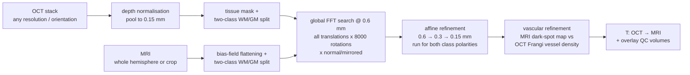
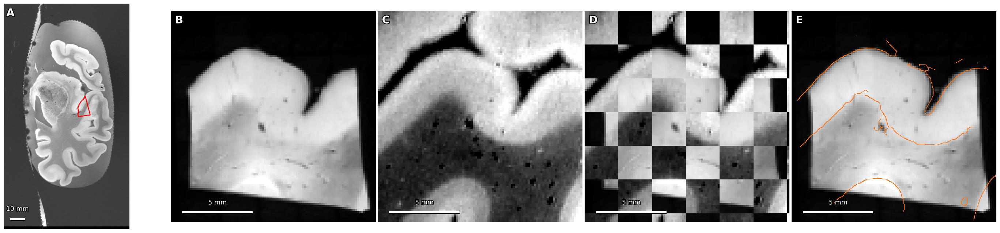
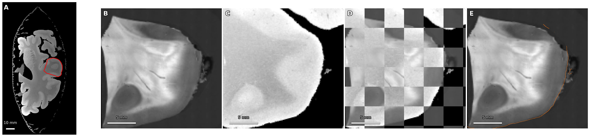
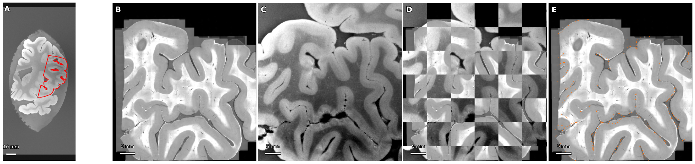
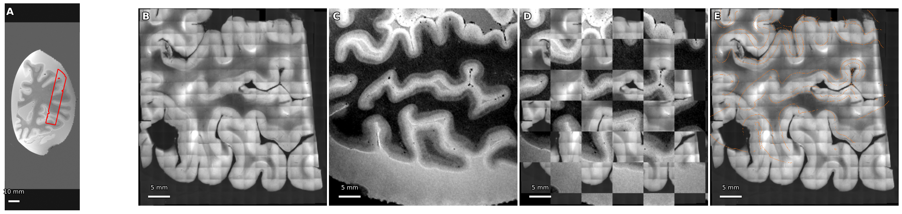
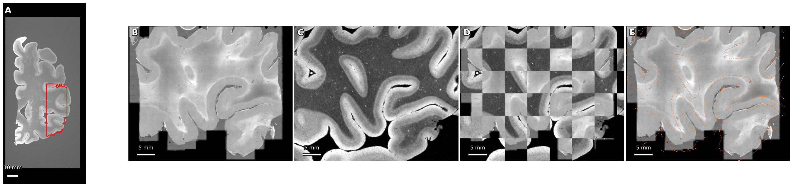
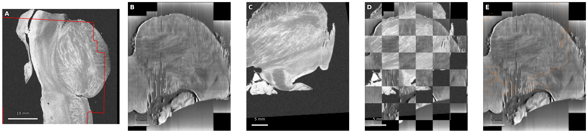

# OCT block → MRI registration: a label-free pipeline, validated across subjects

Yuntian Yang, 2026-08-21

## Summary

I rebuilt the OCT-block-to-MRI registration as a small, training-free pipeline: it takes the two images and their voxel sizes, nothing else — no annotations, no masks, no position prior. On the public Costantini dataset it correctly places blocks from five subjects into their whole hemispheres, from a 15 mm block up to 50 mm slabs that match gyrus-by-gyrus; where manual annotations exist, the accuracy reaches the ceiling of the annotations themselves. I then ran the same pipeline on the first pair of our own data (the I58 brainstem block Xiangrui uploaded) and it finds the correct global pose there too, again with no prior. All results, transforms and overlay volumes are organised on the compute server for manual inspection.

## Method

One idea: reduce both modalities to the same two-class structure map (WM/GM), match globally in that space, then let vessels do the sub-millimetre part.

Slightly more concretely:

1. **Structure maps, no training.** OCT: the serial-sectioning depth attenuation is removed per slice, the stack is pooled to 0.15 mm, and the tissue is split into two intensity classes (Otsu). MRI: the intensity is first divided by its local mean (σ = 10 mm Gaussian — this removes the bias field and is what makes a plain Otsu split work on a whole hemisphere: WM/GM agreement with the manual labels goes from Dice 0.66/0.62 to 0.90/0.93), then split the same way.
2. **Global search.** The two class maps are correlated at 0.6 mm with a masked, FFT-based normalized cross-correlation over *all* translations × 8 000 rotations × both handednesses — 150 s for a full hemisphere. The mirror branch is essential: several OCT stacks are mirrored relative to their MRI.
3. **Affine refinement** at 0.6 → 0.3 → 0.15 mm (rigid → similarity → affine, with a scale prior). Which OCT class is WM is a protocol property that the coarse search cannot decide, so this stage runs for both assignments and keeps the better refined score.
4. **Vascular refinement.** A third channel is added to the same correlation: an MRI "local darkness" map (vessels are dark spots in ex-vivo FLASH) against the density of our own Frangi vessel segmentation of the OCT at 24–35 µm. This is what pins down the scale along the block's depth axis, which the tissue geometry cannot see (see the I46 paragraph below). Still label-free on both sides.

All windows and kernels are physical sizes (mm/µm), so the same settings run unchanged on 0.12–0.15 mm MRIs and 12–35 µm OCT stacks. One subject takes 15–40 min on a single RTX 4090, whole-hemisphere search included.

## Validation on public data (DANDI:000026, Costantini 2023)

The dataset has OCT blocks from BA44/45 with whole-hemisphere ex-vivo FLASH for several subjects; I downloaded the pairs plus the manual annotations (60 GB in total — labels are used only to score results, never by the method).

All figures use the same layout and the standard registration-QC conventions: **(A)** the MRI slice through the block centre with the registered block outline (red); **(B)** the raw OCT mid-depth slice; **(C)** the raw MRI resampled to the same plane by the computed transform; **(D)** a checkerboard of B and C — anatomy should continue across tile borders; **(E)** edges of the registered MRI (orange) over the OCT — edges should follow the OCT's own boundaries. Grayscale anatomy, robust 1–99% windowing per volume, physical scale bars.

| subject | block | agreement with the manual annotations |
|---|---|---|
| I46 | 15×15×7 mm @ 12 µm | manual MRI vessels → nearest OCT vessel: 265 µm / 28% within 150 µm before the vascular stage → **167 µm / 47%** after (random-placement control ~350 µm; the annotation-fitted ceiling is 47%); Dice WM/GM 0.80 / 0.83 |
| I55 | 22×21×16 mm @ 12 µm | vessels **141 µm / 52%**; Dice WM/GM **0.92 / 0.93** |
| I38 | 29×52×47 mm slab @ 30 µm | labels cover the slab only partially — verified on the overlays, gyrus-by-gyrus |
| I56 | 33×49×44 mm slab @ 30 µm | same — gyrus-by-gyrus |
| I62 | 30×48×42 mm slab @ 30 µm | no hemisphere labels — verified on the overlays |

*Figure 1 — I46, 15×15×7 mm block at 12 µm, placed into the whole hemisphere with no prior. In (E) the MRI's pial and sulcal edges run along the OCT's own surfaces.*

*Figure 2 — I55, 22×21×16 mm block. The curved lateral boundary is continuous through the checkerboard (D) and traced by the MRI edge in (E); Dice vs the manual labels 0.92/0.93.*

*Figure 3 — I38, a 29×52×47 mm slab at 30 µm. Every gyrus in the OCT (B) has its counterpart in the registered MRI (C); the folding pattern continues across the checkerboard tiles (D).*

*Figure 4 — I56, 33×49×44 mm slab: same gyrus-by-gyrus correspondence.*

*Figure 5 — I62, 30×48×42 mm slab.*

Two findings worth keeping:

- **The depth-axis scale must come from vessels, not tissue.** On I46 the tissue-class correlation is flat when the block is stretched along its depth axis — the block is one GM/WM sheet, so the geometry carries no information about that scale — and the true solution needs a ~20% stretch there. The vascular channel recovers it and takes the vessel score to the annotation ceiling. I55 confirms the story from the other side: its metadata records the correct (anisotropic) depth spacing, and there the vascular stage moves the block by only 0.3 mm. The general lesson: expect the OCT depth spacing in metadata to be wrong or missing, and expect the pipeline to recover it.
- **Polarity and handedness differ between subjects of the same dataset** (I46 is GM-bright and mirrored, I55 WM-bright and not mirrored). Neither can be assumed; both are searched automatically.

## First run on our own data (I58 brainstem)

The pair from Xiangrui's folder: a 20 µm OCT of a brainstem block (29×40×32 mm) and an 80 µm MRI already cropped to the block. I moved both to the compute server (13 GB, checksum-verified) and ran the same pipeline. Two things are specific to this data: the OCT cannot separate tissue from the agarose embedding by intensity (both scatter), so the overlap gate in the search now adapts to the tissue volumes of the two sides; and the OCT stack carries strong section-seam artifacts.

With that, the global search and affine stage find the correct pose with no prior: the specimen outline, the dome-shaped section and even a separate small tissue piece all land on their MRI counterparts, and 10/12 perturbed restarts return to the same pose. The residual is a few millimetres — Figure 6 (D) shows boundaries continuing across tiles with a visible but bounded offset. Getting from "correct pose" to sub-millimetre needs two targeted pieces: a specimen mask that separates tissue from agarose (texture-based, the boundary is clearly visible), and an artifact-robust fine channel; the fiber texture that both modalities clearly share (panels 2 vs 3) is the signal to use.

*Figure 6 — our I58 brainstem pair (20 µm OCT, 80 µm MRI). The dome-shaped section with its internal fiber fascicles appears identically in (B) and (C); the checkerboard (D) shows the outline continuing across tiles with a few-mm residual toward the bottom. The vertical striping in the OCT is the section-seam artifact discussed above.*

## Where everything is

On the compute server, `~/autodl-tmp/oct-mri-registration/`:

- `results_inspection/<run>/` — one folder per registration for manual checking: the transform (`T_oct2mri.npy/.lta`), `result.json` with all diagnostics, the overlay QC figures, and NIfTI volumes on a common grid (`mri_region.nii.gz` + `oct_in_mri_region.nii.gz`) that open directly in Freeview/ITK-SNAP. `INDEX.md` lists every run with its verdict.
- `octreg/` — code (README has the full method and reproduction commands); `octreg/figures/` — the figures above.
- Running a new pair is two commands: `prep_subject.py --mri ... --oct ...` then `register.py` (handles NIfTI and TIFF OCT, any voxel sizes).

## Next

- by Sep 4: the brainstem pair to sub-millimetre (specimen mask + artifact-robust fine channel), rechecked on the DANDI subjects as regression.
- by Sep 18: as more of our blocks arrive, run each within a day of arrival and keep the inspection folder as the running record; per-block report of pose, depth scale and QC.
- then: the OCT → LSFM link on the same machinery.
