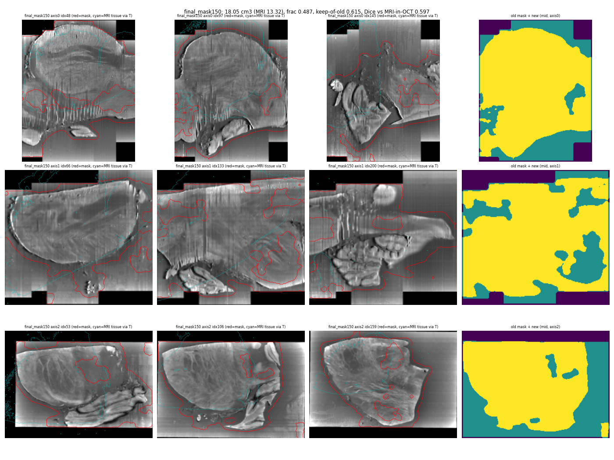
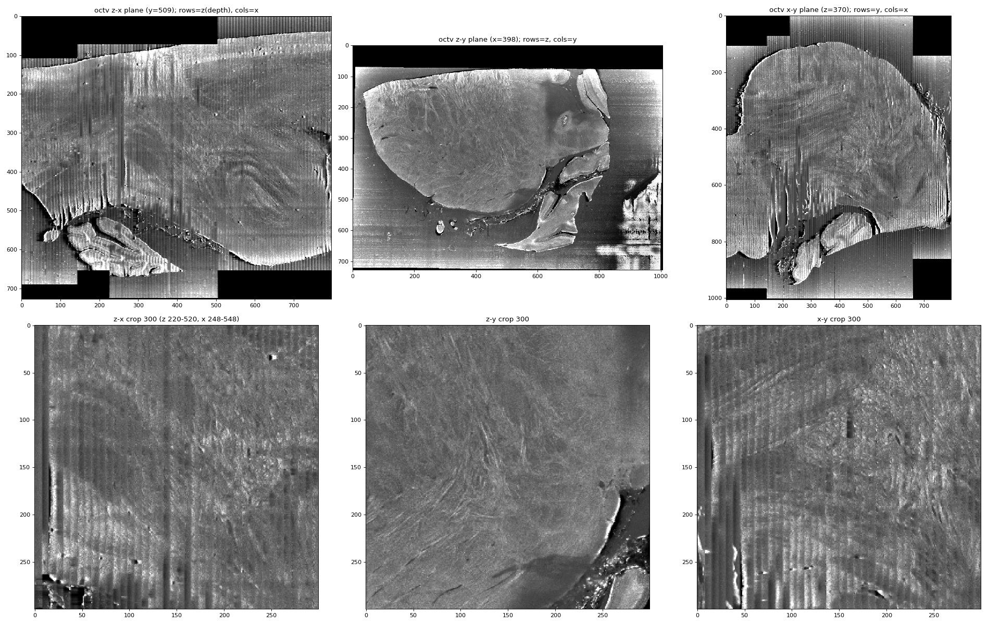
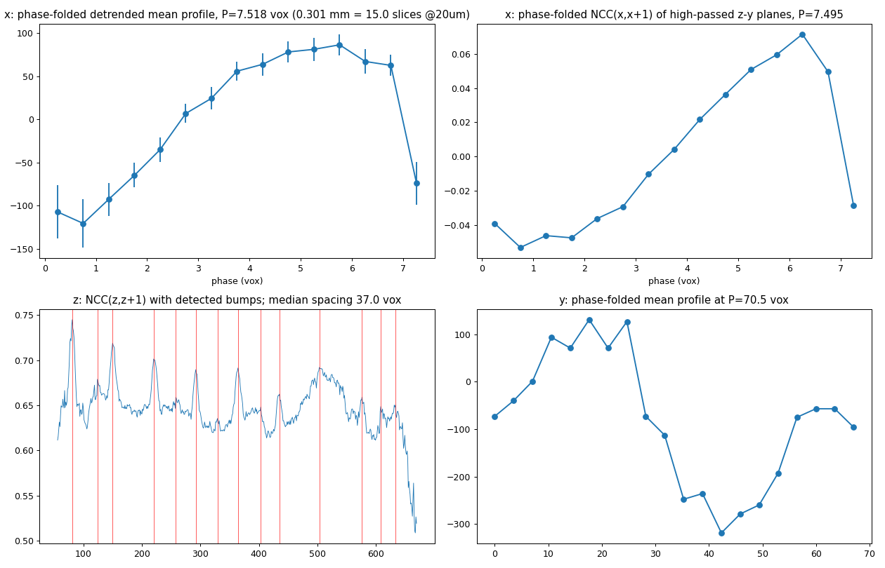
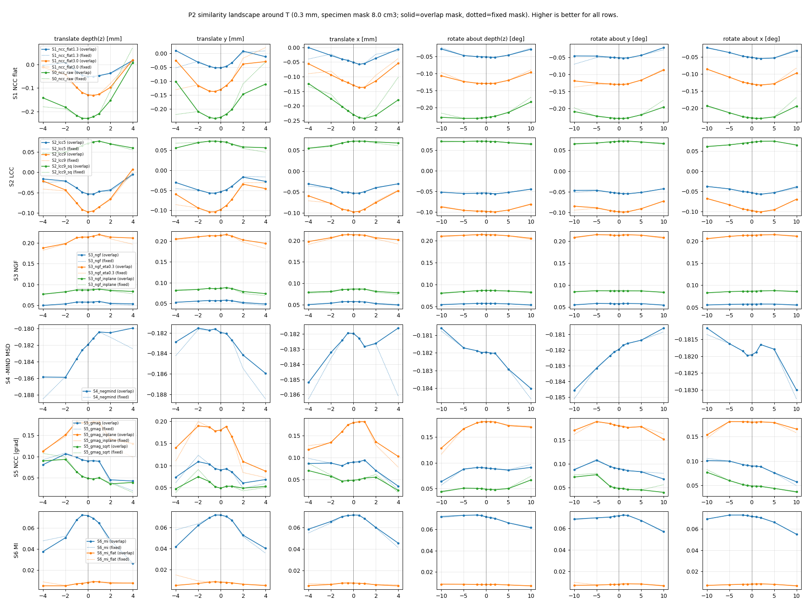
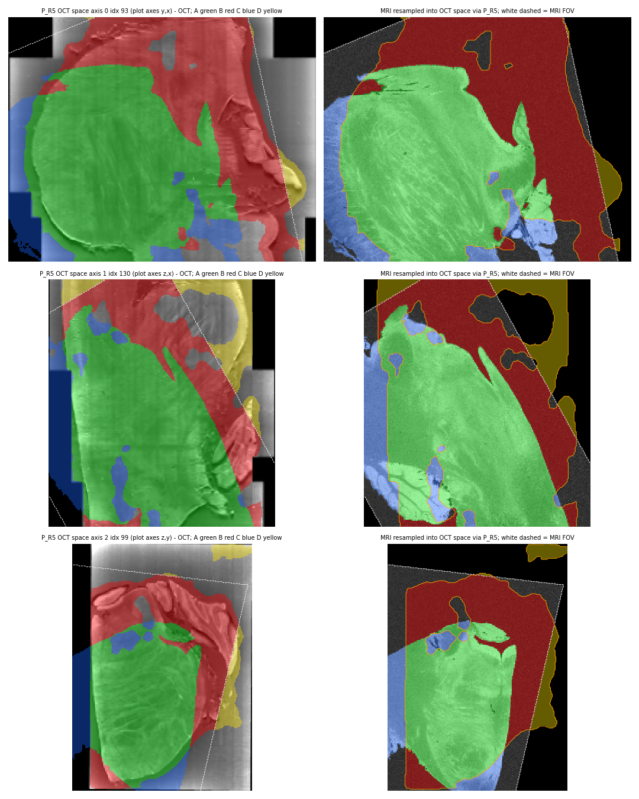
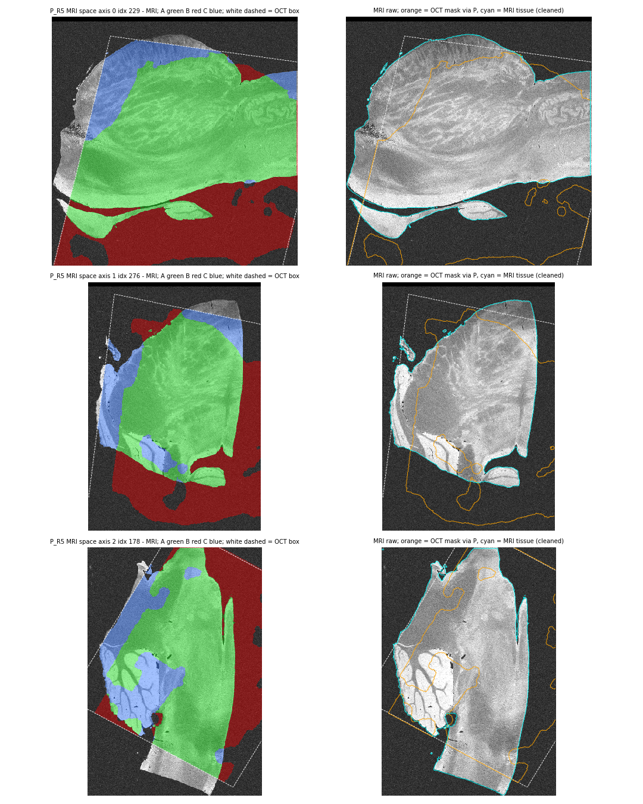
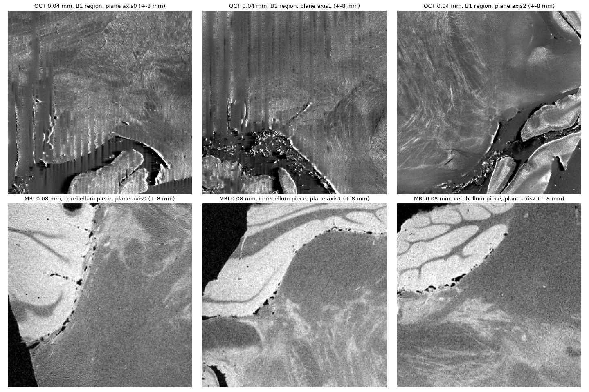
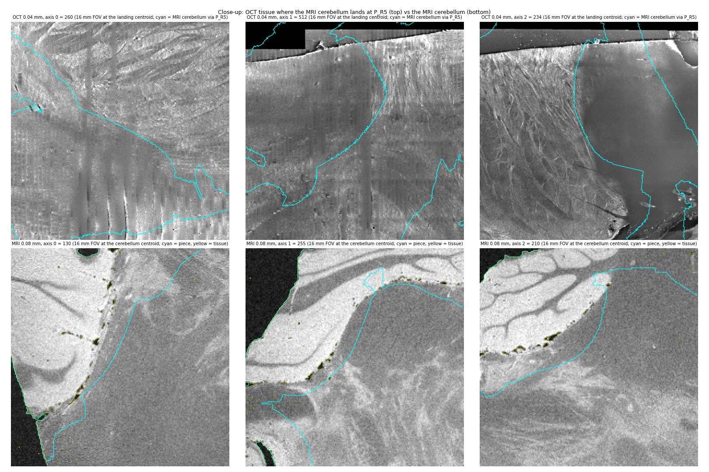
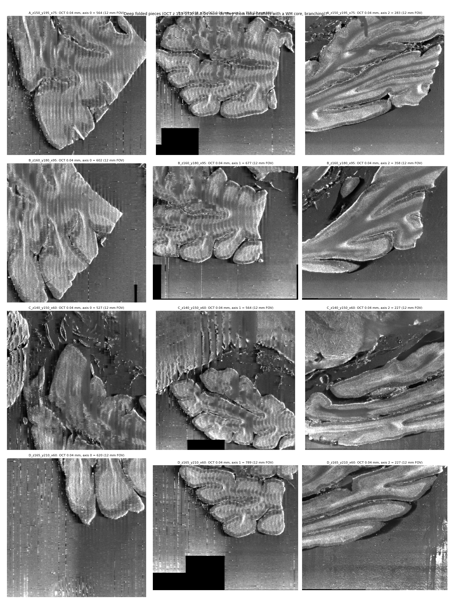

# octreg v1.1 on the I58 brainstem pair: technical record

Date: 2026-09-13. Code: `octreg` commit 4170ef0 (v1.1) on top of 7ef90e5 (v1 baseline); probe records and figures in docs/v11 (commit fdbaf36). Server: `/root/autodl-tmp/oct-mri-registration` on the AutoDL box (prep under `work/v11/`, runs under `work/runs/v11/`, probes under `work/probe_xr/`, logs under `logs/v11_*.log`). Data: I58 = the lab's own brainstem pair from Xiangrui, a 20 um OCT scattering-coefficient map of a brainstem block in agarose (13 GB, array 1457 x 2013 x 1595) and an 80 um MRI cropped from a whole-brain scan to the OCT block (92 MB, 343 x 489 x 495), no labels. Every number below carries its source in parentheses: a probe id (P1 to P10, docs/v11/probe_*.json), a run name (result.json / qc_fine.json under work/runs/v11), a prep.json, a log, or the implementation review record (docs/v11/implementation_review_record.json).

## 1. Bottom line

1. The v1.1 additions work as specified: the texture specimen mask cuts the OCT mask from 28.86 to 18.05 cm3 (P1, R4 prep), the destripe removes the 0.30 mm section stripes (x-profile residual 139 to 50, R0_destripe), the fine stage runs with the correct inverted polarity (guard 26/34 blocks negative, R5), and the v1 default path is unchanged by construction and by test (review:zero-diff).
2. The whole-block structural pose on the native v1.1 prep is reproducible: seed 1 and the no-destripe ablation land within 0.31 mm / 1.1 deg and 0.35 mm / 1.4 deg of the reported run at the 7 mm cube (0.56 and 0.67 mm at the block corners; pose_move on the server, R5 vs I58_seed1 / xiangrui_I58bs_nods).
3. The fine stage never converges on this pair: 0/8 restarts within 0.3 mm in all six runs, self-consistency U 2.6 to 5.7 mm, and the candidates of different runs are 2.5 to 11.6 mm apart at the block corners; every gate rejected it and the shipped pose is the structural pose in every run (result.json of all six runs).
4. The reason is the data, not the optimiser (P5 to P10): the OCT mask keeps about 5.5 cm3 of striped agarose and lamellar pockets that no rigid pose maps onto MRI tissue (P8), the MRI crop truncates the specimen on three faces (P8), and the MRI cerebellum has no rigid counterpart in the OCT block, although torn cerebellar folia are physically present at the bottom of the block on the opposite side of the body (P10).
5. What this pair supports label-free is a body-level pose: boundary agreement median 2.02 mm forward / 1.05 mm reverse on the rim faces (R5 qc_fine), with a rotational ambiguity of several degrees (P2, P7).
6. Needed next: the un-cropped MRI or the crop box, the dissection and embedding sequence (was the cerebellum detached), the OCT axis metadata (which array axis is optical depth, any refractive-index depth scaling, because P7 finds a +0.08 to +0.35 log-scale preference along array axis 0), and about 20 landmark pairs on the body for a target registration error.
7. DANDI regression (section 6): the v1.1 default path reproduces the v1 snapshot on I46 and I55 bit for bit (regress.py 0 FAIL of 26 rows on each, every delta 0; vascular gates accepted with margins 0.023 and 0.046). `--fine on` is NOT validated on cortex: it passes its own gates (8/8 restarts, U 0.4 to 1.1 mm) yet degrades the labelled metrics (I46 own-vessel median 123 to 165 um, vesseg 167 to 264 um, depth stretch 1.219 to 1.31; I55 Dice GM 0.930 to 0.916), so it stays off by default and self-consistency must not be quoted as accuracy.
8. Update 2026-09-14 (Appendix C.4). The pipeline runs end to end on Xiangrui's pair from the two original NIfTI files with one command (`scripts/run_xiangrui_i58.sh`, 27.6 min, peak 32 GB) and reproduces the reported pose exactly (0.00 mm at the block corners); its result is also exported in the original NIfTI frames (4x4, FreeSurfer LTA, overlays). Two further levers were tested with criteria declared before the runs, and neither is adopted. Re-normalising the OCT intensities (the axis-0 slab correction, a per-section normalisation along the sectioning axis, a 2-D tile flat field) shows no measurable benefit in the local objective at P_R5: structural NCC changes <= 0.0004, the local 0.3 mm refits stay within 0.55 mm of the current prep's refit, and the axis-0 stretch preference of the fine NCC and MI changes by <= 0.011 (search and restarts were not re-run). Excluding the cerebellum and the deep folia from the structural objective makes the pose jump 6.5 to 8.2 mm into a basin that is worse on body boundary agreement, and the global search then prefers mirrored or FOV-degenerate poses. The handedness of the OCT relative to the MRI is not decided by the data. The other-handedness pose that register.py finds gives a better forward outline (rim 1.57 vs 2.02 mm, y+ face 1.48 vs 4.96 mm, reverse 1.08 vs 1.05 mm) but a lower internal class correlation (NCC 0.113 vs 0.124, restarts 1/12 vs 6/12, 4 % shrink on two axes). Another pose of that handedness, 30.6 mm from it with a 5.4 % isotropic shrink (P11 exclude), scores 0.136 on the same objective, so class NCC does not decide the handedness either. The two candidates are 30.5 mm apart. Taken at face value, the NIfTI headers (OCT LPI, a plain flip written by FreeSurfer matlab, and MRI RIA) make the reported pose a mirror image and the other candidate proper, but this counts only if both headers record the physical orientation, which is unverified. Both candidates are exported for a visual decision.

## 2. What v1.1 built

The target of v1.1 (spec_v11.json) was to run I58 end to end and make the method handle agarose embedding, section-seam striping and non-cortical tissue without changing results on the cortical DANDI subjects. Four things were built, each behind a flag whose default reproduces v1.

### 2.1 Texture specimen mask (octreg/specimen.py, `prep_subject.py --oct-mask auto`)

Why the v1 mask fails on I58: the histogram threshold in `common.histogram_tissue_threshold` finds no valley in the unimodal I58 OCT histogram (peak about 17k) and falls back to the noise floor, so the v1 mask is the whole block minus the black tiles: 28.86 cm3, 77.9 % of the 37.06 cm3 box, 2.17 times the MRI tissue volume of 13.32 cm3 (P1, P4). The agarose is scatterer-doped, so intensity cannot separate it from tissue (agarose medians 17.4k to 19.4k vs tissue 16.4k; 3-D local std at 0.15 mm 714 to 931 vs 793, P1). What does separate them is texture anisotropy: agarose artefacts are quiet along array axis y while tissue texture is isotropic, and the min-over-axes directional std at 0.04 mm after a 0.08 mm band-pass gives agarose 124 vs tissue 433 (86 % of the agarose reference below the tissue 5th percentile, P1).

Recipe (P1 candidate g, spec 1.3): texture field F = min over axes of the masked 1-D running std (window 0.36 mm) of the 0.08 mm band-passed 0.04 mm volume, pooled to a 0.16 mm working grid and smoothed 0.48 mm, normalised by the local mean; threshold from a two-component Gaussian mixture on log F (I58: thr 0.01514, log-means -4.47 / -3.75; Otsu-type thresholds split at the rim class and give 4.6 cm3, P1); markers from F opened by 0.64 mm; watershed on the 0.04 mm rim strength (3-D local std, window 0.20 mm) so the boundary snaps to the bright specimen rim where one exists; exterior pockets enclosed by the specimen are reassigned to the specimen; closing 0.48 mm on an edge-padded array, largest connected component, hole filling; resampled to the 0.15 mm and 0.04 mm grids. The auto rule selects the texture mask only when V_intensity > 1.5 V_MRI and the texture volume lies in 0.5 to 1.75 times V_MRI (spec 1.3 step 8); on I58 the ratio is 2.17 so the rule fires, on DANDI it is 0.72/803 (I46) and 5.5/621 (I55) so it never fires (spec P0.1).

Validation numbers:

- P1 (probe): 18.05 cm3 at 0.15 mm (5,347,436 voxels, fraction 0.487, 1.355 times the MRI tissue), 18.06 cm3 at 0.04 mm, one connected component, keeps 61.5 % of the old mask, 1.65 % of it outside the old mask.
- R0_mask (port check, work/v11/tests/mask, logs/v11_R0_mask.log): 18.048 cm3, Dice 0.9999993 against the P1 reference mask (8 voxels differ out of 5.35 M), one component, 123 s with 4 workers, worker peak RSS 4.3 GB.
- R4 native prep (work/v11/xiangrui_I58bs/prep.json): mask_mode texture, reason "auto: V_int > 1.5 V_mri", V_int 28.85 cm3, V_tex 18.048 cm3, thr 0.01514, GMM log-means -4.469 / -3.747 (weights 0.41 / 0.59), 13 components on the working grid before the largest-component rule, 1 at 0.15 mm, 126 s.
- R2 smoke prep from the cached 40 um octv (work/v11/I58bs_s40/prep.json): 17.60 cm3, thr 0.01563 (the cached octv is slab-normalised a second time, impl:A open item 3).

Known limit (P1 caveat 1, quantified in P8, section 4.2): the mask is still 1.36 times the MRI tissue. The excess is the striped comb band under the ventral surface, striped tile pockets at the deep end, and lamellar sheets with enclosed agarose.

Figure 1. P1 final texture mask (red) on three planes of oct150 per array axis at about 1/4, 1/2 and 3/4 of the extent (axis 0 indices 48 / 97 / 145, axis 1 66 / 133 / 200, axis 2 53 / 106 / 159; only the middle one is a mid-plane), with the MRI tissue mapped through the v1 pose (cyan); right column: old intensity mask (teal + yellow) vs new (yellow). Source: P1, work/probe_xr/mask/final_mask150.png.

### 2.2 Axis-detected destripe (octreg/destripe.py, `prep_subject.py --destripe on`)

What the stripes are (P3): planes of constant array index 2 (x), extending over the whole y and z, period 7.518 voxels at 0.04 mm = 0.3007 mm = 15.0 slices at 20 um, phase-folded waveform a sawtooth (ramp over about 6 voxels, sharp drop), adjacent-plane correlation lowest right after each drop. Adjacent-plane NCC of high-passed planes: 0.427 along x vs 0.667 along y and 0.645 along z (P3). Together with a 70.5-voxel (2.82 mm) tile periodicity in both z and y and FOV extents that step with x, this says array axis 2 is the physical sectioning axis and axes 0 and 1 are the en-face mosaic axes. v1 assumed axis 0 was the depth axis: its slab normalisation (window 60 slices along axis 0) runs along an en-face axis and only removed smooth per-slice offsets (std 1.8 % of the level, P3). Local stripe amplitude is about 9 % of the intensity level and 28 % of the tissue std, up to 16 % in the worst region; the pattern decorrelates along z within about 2 mm, so the correction has to be local (P3).

Figure 2. P3: octv planes (top: z-x at y = 509, z-y at x = 398, x-y at z = 370; bottom: 300-voxel crops). Vertical streaks in the z-x and x-y planes, none in the z-y plane: sheets normal to x. Source: P3, work/probe_xr/stripes.

Figure 3. P3: phase-folded x profile at period 7.518 voxels (sawtooth), folded adjacent-plane NCC along x, the z adjacent-plane NCC with its detected bumps (that panel's own detector reports a median spacing of 37.0 voxels = 1.48 mm; the 2.8 mm = 70-voxel tile period is P3's autocorrelation and fold result, with bumps at z = 81, 150, 220, 292, 364, 435 spaced 69 to 72 voxels), and the y profile folded at 70.5 voxels. Source: P3.

Recipe (P3, spec 1.4): detect the stripe axis as the array axis with the lowest median adjacent-plane NCC of high-passed planes (accepted if below 0.8 times the second smallest); flat-field by normalised convolution: smooth over the two non-stripe axes with sigma 0.48 mm, low-pass along the stripe axis with sigma 0.24 mm, subtract the difference (additive; multiplicative was not better), zeros stay exactly zero (missing tiles), clip to [1, 60000] before the float16 write-back; processed in 64-slice chunks with 40-slice padding by 4 workers. oct150 is then derived from the destriped octv (block means coincide with v1's pooling because 8 = 2 x 4), and oct150_nodestripe.npy is kept for the ablation.

Validation numbers:

- R0_destripe on the v1 octv (work/v11/tests/destripe, logs/v11_R0_destripe.log): adjacent-plane NCC medians (z, y, x) 0.648 / 0.664 / 0.429, ratio 0.662, axis 2, period 7.51 voxels; x-profile residual std 139.0 to 50.1 (y 149.4 to 148.8, z 308.9 to 305.1); oct150 x residual 85.4 to 49.3; stripe FFT peak gone (7.5 voxels before, 48.8 after); zero fraction 0.2074 unchanged, min nonzero 1.0, max 60000, no non-finite values; 95 s for 12 chunks x 4 workers; all ten checks pass (target x residual <= 55, other axes change < 3 %).
- R4 native prep (work/v11/xiangrui_I58bs/prep.json, destripe block): axis 2 (NCC medians 0.630 / 0.661 / 0.351, ratio 0.557, period 7.49 voxels); profile residual std measured inside the 2 mm-eroded texture mask: x 257.6 to 94.6, y 477.6 to 469.9, z 906.8 to 877.2 (the absolute values differ from the test because the statistics region is the texture mask, not the v1 mask); zero fraction 0.2074 unchanged, min nonzero 1.0, max 60000, 0 non-finite; 97 s; oct150_provenance "from_destriped_octv". The R2 smoke prep gives the same axis and ratio (0.558) with x 264.0 to 103.2.
- I46 (informational, logs/v11_R0_destripe_I46.log): the detector is decisive on axis 0 (NCC 0.439 vs 0.799 / 0.795), period 16.2 voxels = 0.39 mm at 24 um, z residual 18.8 to 3.8; the informational "other axes change < 3 %" row fails (y 4.0 to 4.3, x 5.2 to 5.6), which is why that step exits 1 in the chain. Destripe stays off on DANDI (zero-diff), so its effect there is untested.

What the destripe does not fix (P3): the per-plane in-plane noise level is itself modulated by the section phase (1.3 to 1.8 x), the adjacent-plane NCC along x stays 0.43, and the 3-D Frangi vessel channel is not salvageable on this data (top-1 % vesselness density per x-plane modulated 2.54 x by the section phase, 35 % of its variance; elongated components within 15 deg of x: 0 to 1 % vs 3.4 % isotropic). Vessels are therefore skipped for I58 (`--skip-vessels`) and the vascular stage is off. The slab normalisation still runs along axis 0 (harmless on I58, moving it breaks zero-diff on DANDI; v1.2 item, section 7).

### 2.3 Sign-corrected flattened-NCC fine stage with acceptance gates (octreg/fine.py, `register.py --fine on`)

Why a new similarity (P2): at 0.3 mm around the v1 pose, inside a specimen mask (MRI tissue eroded 1.3 mm mapped through T, intersected with the OCT mask, 7.97 cm3), the OCT mu_s to MRI intensity relation is inverted: raw masked NCC is -0.23 at T and a sharp V-shaped minimum along all six axes, i.e. |NCC| peaks at T. 26 of 37 sub-blocks of about 7 mm are negative (volume-weighted mean -0.147, range -0.63 to +0.18), so the sign flip is justified but not universal. This explains v1's negative WM-channel NCC on this pair (v1 run: channels [-0.017, 0.220]). Ranking by peak-to-shoulder contrast (sign-corrected): 3 mm-flattened masked NCC 0.54 (value 0.130 at T) > LCC with a 4.5 mm box 0.45 > raw NCC 0.36 > MI-32 0.28 > NGF 0.09 to 0.11 > MIND-SSC 0.02 (no optimum at 0.3 mm). Half-widths 1.2 to 3 mm in translation and 4 to 8 deg in rotation. All 11 measures agree on the direction of the residual from the v1 pose: OCT-y -0.25 to -0.94 mm, OCT-x +0.05 to +1.0 mm, depth 0 +- 0.5 mm; rotation about OCT-x undetermined at +- 3 deg (P2).

Figure 4. P2 similarity landscapes around the v1 pose at 0.3 mm (rows: flattened NCC, LCC, NGF, MIND, gradient-magnitude NCC, MI; columns: translations along the OCT array axes in mm, rotations about them in deg). Higher is better; the NCC rows are shown with their raw sign, so the sharp minimum at 0 is the inverted relation. Source: P2, work/probe_xr/sim/landscape.png.

Design (spec 2.4, implementation review impl:B and fix:B): the stage optimises a delta D about identity with the start pose folded into the loss (T = T_start @ D), so the existing Refiner's log-scale and shear clamps (0.15 per step) are relative to the start; two levels, 0.3 mm (OCT pooled x2, MRI pooled x4 = 0.32 mm) and 0.15 mm (OCT native, MRI pooled x2); bias flattening by masked normalised convolution with sigma 3 mm, each image in its own space under a pose-independent mask (OCT mask & validity for the OCT, MRI tissue for the MRI), z-scored inside that mask (spec 2.4; this pose-independent choice rather than P2's m_spec is why the port gives 0.1377 at the v1 pose where P2 gave 0.1295, impl:B open item 2); the specimen mask m_spec = (MRI tissue eroded 1.3 mm, mapped through the pose at the level start) & OCT mask & validity, fixed within a level; a polarity guard at each level (4 x 4 x 4 tiling of the mask bounding box, sign -1 if >= 60 % of the blocks are negative and the volume-weighted mean <= -0.05, +1 for the opposite, otherwise "mixed"); similarity auto = ncc when the guard is decisive, sign-free LCC^2 when mixed; schedule rigid 150 then affine 200 iterations at 0.3 mm, affine 200 at 0.15 mm with halved learning rates. The MRI tissue sampled through T is a detached weight.

Verification and gates, all label-free (spec 2.4, fix:B): V1 eight perturbed restarts (rotation 2 to 6 deg, translation up to 2 mm per axis, log-scale +- 0.03), converged if within 0.3 mm of T_fine at the eight block corners; V2 multi-similarity witnesses (dense LCC from the start, Nelder-Mead MI-32 from T_fine); V3 split-half along each OCT axis; V4 landscapes of the fine loss and MI-32 on nine axes (translations +- 2 mm, rotations +- 5 deg, log-scale +- 6 %); V5 inverse consistency (`--fine-verify full`). Acceptance requires all of: (a) loss gain >= 0.002 at the finest level, (b) structural [WM, GM] NCC drop <= 0.02, (c) block-corner move <= 3.0 mm and rotation <= 5 deg, (d) >= 5 of 8 restarts converged, (e) MI-32 drop <= 0.001, (f) finest level not skipped, (g) U_mm <= 3.0 mm, (h) no failed optimisation step. U_mm = max(restart p95 displacement, largest pairwise mean displacement between the fine, LCC and MI solutions, split-half maximum). A rejected stage returns the start pose and stores the candidate as T_oct2mri_fine_candidate.npy; that is normal behaviour, not an error (spec P0.5). Gate (c) was changed during review from the 7 mm transform_diff cube to the block's own corners (radius 29.3 mm on I58), and a 5 deg rotation cap and gate (g) were added, because a 12 deg rotation of this block counts as only 2.1 mm in the 7 mm cube against 6.2 mm at the block corners (review:numerics finding 2, fine.pose_move docstring), and two measured CPU candidates rotated 12.2 and 13.0 deg with 7 mm-cube moves of 2.68 and 2.61 mm passed the old cap (review:integration finding 1).

Reproduction of P2 in the port (R0_fine_cpu, logs/v11_R0_fine_cpu.log, CPU, 0.3 mm level, 5 iterations): guard 28 of 37 blocks negative (0.757), mean -0.150, sign -1; sign-corrected flattened NCC at the v1 pose 0.1377 (P2: 0.1295, spec tolerance +- 0.01; 0.1300 when the OCT is re-flattened under P2's m_spec instead of the spec's pose-independent mask, impl:B tests_run 4); structural NCC at the v1 pose 0.1013.

### 2.4 Prior path, vascular gate, QC tooling

- `register.py --init-transform PATH` (spec 2.2): a 4 x 4 OCT world to MRI world prior skips the FFT search and the structural refinement; the class polarity is evaluated (not optimised) at the prior when `--oct-wm-bright auto` (R1: wm_bright True gives structural NCC +0.1014, False gives -0.1014 at the v1 pose). This is the fallback the PI allows for I58, since the MRI is already cropped to the block (position prior).
- Vascular gate and auto-skip (spec 2.3, fix:B): `--vascular auto` runs the stage unless prep.json records a section-phase modulation ratio > 1.6 (`--vessel-modulation-max`); after the stage, the pose is accepted only if the vessel-channel NCC >= 0.02, the mean [WM, GM] NCC drops by <= 0.05 (`--vascular-struct-drop`; the spec said 0.03, raised because v1's accepted I46 solution drops 0.027, a 0.003 margin) and the block-corner move is <= 3 mm. Reproduced on the stored v1 poses (review:zero-diff): I46 vessel NCC 0.296, drop 0.027, move 1.06 mm at the block corners, accepted; I55 0.083, 0.0037, 0.46 mm, accepted; I58 v1 0.0055, would be rejected (the intended behaviour, spec F3). On the I58 v1.1 preps there is no vessels file, so the stage is off.
- QC tooling (owner C): `scripts/qc_fine.py` measures boundary agreement in both directions (OCT mask boundary through T against the EDT of the cleaned MRI tissue boundary, and MRI tissue boundary through inv(T) against the OCT mask boundary; per face class by outward normal, the rim-less deep-end face z+ reported separately; points within 1 mm of an MRI FOV face excluded), an MI-32 landscape on the nine axes at the 0.15 mm level, and a figure with five OCT planes x {OCT, MRI via T, 0.9 mm checkerboard, Canny edge overlay} with the prefine (dashed) and final (solid) MRI tissue contours; `scripts/regress.py` compares two runs against the spec 5.3 tolerance table; `scripts/test_specimen_mask.py`, `test_destripe.py`, `test_fine.py` run each component standalone; `viz_result.py` gains a prefine column and tolerates missing vessel files; `summarize.py` gains the fine, gate, mask and destripe columns; `run_v11_i58.sh` and `run_v11_regress.sh` are the serial run plans.

### 2.5 Zero-diff on the v1 default path

Reviewed by diff and by test (review:zero-diff): the frozen files (common, refine, search, features, vascular, evaluate, nonrigid, parser, synth, fig scripts, run_subject.sh, run_all.sh) are untouched; with default flags prep_subject.py was run against a copy of the 7ef90e5 script on two synthetic stacks (40 um and 12 um paths) and all ten .npy outputs were bit-identical, prep.json's v1 keys identical, with only the diagnostic files oct150_mask_intensity.npy and oct150_mask_qc.png and new keys added; register.py's default path differs from v1 only by the two Refiner.evaluate calls of the vascular gate, which use no random numbers, and the gate accepts both DANDI v1 poses (above). The only changed default of an existing flag is `--vascular on` to `auto`. The numeric confirmation on real DANDI runs is section 6.

## 3. I58 results, run by run

All runs on the RTX 4090, serial, `logs/v11_chain_i58.log`: R0 to R3 10:53 to 11:21, R4 11:26 to 11:38, R5 to R11 12:02 to 12:28 (2026-09-13). Run names are directories under `work/runs/v11/`.

### 3.1 Prep numbers (R2 smoke vs R4 native)

| quantity | R2 smoke (work/v11/I58bs_s40) | R4 native (work/v11/xiangrui_I58bs) |
|---|---|---|
| input | cached 40 um octv.npy of the v1 prep, re-normalised (window 30) | 20 um NIfTI, 1457 x 2013 x 1595, slab window 60 |
| MRI tissue | 13.315 cm3 (thr 0.541, fraction 0.313) | same |
| intensity mask | 28.85 cm3 (fraction 0.778) | 28.85 cm3 (0.778); 28.86 without destripe |
| texture mask | 17.60 cm3, thr 0.01563, ratio 1.32 | 18.05 cm3, thr 0.01514, ratio 1.355, fraction 0.487 |
| mask choice | texture, auto: V_int > 1.5 V_mri | same |
| stripe axis | 2, NCC (z, y, x) 0.627 / 0.663 / 0.350, ratio 0.558, period 7.49 vox | 2, 0.630 / 0.661 / 0.351, ratio 0.557, period 7.49 vox |
| x-profile residual std | 264.0 to 103.2 | 257.6 to 94.6 |
| y / z residual | 344.7 to 341.5 / 689.8 to 670.8 | 477.6 to 469.9 / 906.8 to 877.2 |
| zero fraction, min, max | 0.2074 unchanged, 1.0, 60000 | same |
| vessels | skipped | skipped |
| wall | 275 s (chain log) | 709 s (logs/v11_R4_prep.log; NIfTI read 150 s, slab normalisation 230 s, mask 126 s, destripe 97 s) |

The spec's M1 band (17.5 to 18.6 cm3, ratio 1.30 to 1.40, one component, fraction 0.46 to 0.51) holds on the native prep; M2 (axis 2 with NCC <= 0.8 x the others, x residual reduced >= 2.5 x, zero fraction unchanged, finite) holds (reduction 2.7 x native, 2.8 x in the R0 test; the y/z change is 1.6 % and 3.3 % on the native prep, within 3 % in the R0 test); M3 (vessels skipped, wall <= 60 min) holds; peak RSS of the native prep was not recorded.

### 3.2 Run table

| run | step | prep | start | search top1 / top2 | structural NCC (channels) | structural restarts | centre (MRI mm) | fine candidate: block-corner move / rotation | fine restarts | U (mm) | ICE mean (mm) | fine verdict | wall (s) |
|---|---|---|---|---|---|---|---|---|---|---|---|---|---|
| I58_fine_oldprep | R1 | v1 prep (intensity mask 28.86 cm3, no destripe) | v1 pose | (prior) | 0.1014 ([-0.017, 0.220]) | (prior) | [5.0, -5.6, 20.7] | 5.57 mm / 13.2 deg | 0/8 | 3.21 | 1.96 | rejected (c)(d)(g) | 96 |
| I58bs_s40 | R3 | smoke (17.60 cm3) | search | 0.1398 / 0.1379 | 0.1197 ([0.015, 0.225]) | 4/12 | [3.9, -4.3, 22.0] | 4.68 mm / 10.8 deg | 0/8 | 2.62 | 3.30 | rejected (c)(d) | 456 |
| xiangrui_I58bs | R5, reported | native (18.05 cm3) | search | 0.1379 / 0.1372 | 0.1241 ([0.061, 0.187]) | 6/12 | [5.6, -6.3, 20.5] | 2.97 mm / 1.8 deg | 0/8 | 3.69 | 4.76 | rejected (d)(g) | 451 |
| xiangrui_I58bs_nods | R6 | native, oct150 without destripe | search | 0.1383 / 0.1373 | 0.1218 ([0.057, 0.186]) | 3/12 | [5.6, -6.2, 20.3] | 5.74 mm / 12.9 deg | 0/8 | 5.72 | not run (basic) | rejected (c)(d)(g) | 432 |
| I58_fromold | R7 | native | v1 pose, wm_bright yes | (prior) | 0.1210 ([0.034, 0.208]) | (prior) | [5.0, -5.6, 20.7] | 8.15 mm / 21.0 deg | 0/8 | 3.54 | not run | rejected (c)(d)(g) | 98 |
| I58_seed1 | R7 | native | search, seed 1 | 0.1400 / 0.1388 | 0.1243 ([0.059, 0.189]) | 8/12 | [5.4, -6.3, 20.5] | 2.42 mm / 4.8 deg | 0/8 | 3.43 | not run | rejected (d)(g) | 446 |

(All from result.json; block-corner move = mean displacement of the eight oct150 block corners between the fine candidate and the start pose; the 7 mm transform_diff numbers are 3.24, 2.50, 2.05, 2.74, 4.15 and 1.54 mm respectively. The polarity guard gave sign -1 at both levels in every run, with 65 to 82 % negative blocks and means -0.09 to -0.15. No run was mirrored. The v1 run for comparison, work/runs/xiangrui_I58bs_novasc: top1 / top2 0.1247 / 0.1184, NCC 0.1014, restarts 10/12, centre [5.0, -5.6, 20.7], overlap gate 0.369, 362 s.)

### 3.3 The structural pose and its reproducibility

The reported run (R5) chose OCT wm_bright = True by the refined NCC (0.1241 vs 0.1079 for the other polarity, whose block centre lies 7.2 mm away at [0.2, -1.5, 21.3]; result.json polarity_trials); the search top1 / top2 margin is 0.1379 / 0.1372 = 1.005 (spec S1 wanted >= 1.03; v1 had 1.053), the overlap gate moved from 0.369 (v1, over-inclusive mask) to 0.590 (spec S1 band 0.55 to 0.65), and 6 of 12 structural restarts returned to the solution (spec wanted >= 9; seed 1 gave 8, the no-destripe run 3). The pose is not mirrored, det 0.9998, stretch [1.010, 0.996, 0.994].

Pose differences (fine.pose_move on the server with the oct150 block corners, c_o = [15.89, -20.02, 14.54] mm):

| pair | centre (mm) | rotation (deg) | 7 mm cube corner mean (mm) | block corners mean / max (mm) |
|---|---|---|---|---|
| R5 vs I58_seed1 | 0.24 | 1.11 | 0.31 | 0.56 / 0.97 |
| R5 vs xiangrui_I58bs_nods | 0.24 | 1.37 | 0.35 | 0.67 / 0.94 |
| I58_seed1 vs nods | 0.29 | 2.11 | 0.44 | 0.90 / 1.52 |
| R5 vs v1 pose | 0.94 | 10.56 | 1.96 | 4.61 / 6.57 |
| R5 vs I58bs_s40 (smoke, = P_R3 of the probes) | 3.02 | 16.59 | 3.79 | 6.72 / 10.19 |
| I58bs_s40 vs v1 pose | 2.14 | 20.03 | 3.57 | 7.40 / 12.01 |

So the native-prep structural pose is stable to seed and destripe (spec F9: seed and ablation within 0.5 mm holds at the 7 mm cube, 0.56 and 0.67 mm at the block corners), it sits 0.94 mm and 10.6 deg from the v1 pose (spec S1 allowed 3 mm / 5 deg: the rotation is outside), and the smoke-prep pose is a different pose (16.6 deg away). The 10.6 to 20.0 deg spread between the three prep variants (R5 vs v1 10.56 deg, R5 vs smoke 16.59 deg, smoke vs v1 20.03 deg, table above) is the rotation ambiguity every probe found (P2, P7, P8).

### 3.4 The fine stage: rejected in every run, with reasons

R5 (xiangrui_I58bs, `--fine-verify full`): guard 26/34 blocks negative (0.76, mean -0.126) at 0.3 mm and 21/30 (0.70, -0.112) at 0.15 mm; sign-corrected NCC 0.1253 to 0.1593 at 0.3 mm and 0.1128 to 0.1278 at 0.15 mm (loss 0.9058 to 0.8722, gate (a) passes); structural NCC 0.1241 to 0.1176 (drop 0.0065, (b) passes); MI-32 0.0753 to 0.0903 ((e) passes); the candidate moved 2.97 mm at the block corners (max 5.26) and rotated 1.79 deg, centre shift along the OCT axes (z, y, x) [+1.28, +0.35, +1.24] mm ((c) passes), but its cumulative log-scale is [+0.072, -0.051, +0.116] (stretch 1.01 / 0.996 / 0.994 to 1.139 / 0.947 / 1.068, det 1.146), well beyond the spec's 0.05 per axis. Restarts: 0 of 8 within 0.3 mm; they ended 1.7 to 7.6 mm from the candidate at the block corners with rotations 3 to 17 deg ((d) fails). Witnesses: the LCC solution is 7.53 mm / 16.8 deg from the start and 2.94 mm (mean) from the fine solution, the MI solution 0.54 mm from it, LCC vs MI 2.72 mm; split-half disagreement 3.69 / 2.69 / 2.17 mm along z / y / x; inverse consistency error mean 4.76 mm, p95 7.01 mm. U = 3.69 mm ((g) fails). At the candidate, the fine loss is unimodal on all nine axes with argmax offsets <= 0.02 mm, <= 0.18 deg and <= 0.014 in log-scale, and fine.py's MI-32 has its argmax within 0.23 mm in translation, -1.9 deg about x, and at the -0.06 end for the x log-scale: the candidate is a genuine local optimum of its own loss that nothing independent confirms.

R6 (nods): candidate 5.74 mm / 12.9 deg, shift [+0.20, -2.09, -0.17] mm, restarts 5.7 to 12.6 mm away, LCC vs MI 5.72 mm, U 5.72; rejected (c)(d)(g). R7 fromold (start at the v1 pose on the native prep): candidate 8.15 mm / 21.0 deg, shift [+0.49, -2.26, -0.30] mm, restarts 0.6 to 12.9 mm away (two within 1.3 mm, none within 0.3), U 3.54; rejected (c)(d)(g). R7 seed1: candidate 2.42 mm / 4.8 deg, shift [+0.73, -0.76, +0.93], restarts 2.1 to 10.1 mm away, U 3.43; rejected (d)(g). R3 (smoke): candidate 4.68 mm / 10.8 deg, shift [+0.11, -1.32, -1.07], U 2.62, ICE 3.30 mm; rejected (c)(d). R1 (old prep, v1 pose): candidate 5.57 mm / 13.2 deg, shift [+0.67, -2.14, +0.45], U 3.21, ICE 1.96; rejected (c)(d)(g). The R0 CPU test from the same start already showed the pattern at 0.3 mm (moved 4.09 mm / 10.8 deg, U 3.76, logs/v11_R0_fine_cpu.log).

The candidates of the six runs do not agree with each other: R5 vs seed1 2.53 mm / 2.7 deg, R5 vs nods 6.69 mm / 13.2 deg, R5 vs fromold 8.82 mm / 19.9 deg, R5 vs oldprep 7.25 mm / 14.9 deg, R5 vs smoke 11.62 mm / 27.1 deg at the block corners, with determinants from 0.80 to 1.15 (pose_move on the server). The expected sub-mm polish (P2 consensus offsets from the v1 pose OCT-y -0.25 to -0.94 mm and OCT-x +0.05 to +1.0 mm; spec acceptance F1 and run-plan R1 turned this into a 0.2 to 1.5 mm band at the 7 mm cube with y negative and x positive) did not materialise on the native prep (R5's y component is +0.35 mm); the starts from the v1 pose (R1, R7) do move y by -2.1 to -2.3 mm but with 13 to 21 deg rotations. The spec's F1 to F8 all fail; the correct consequence (spec 5.2 last line) is that T_oct2mri.npy equals T_oct2mri_prefine.npy in every run, which is the case (qc_fine.json pose_diffs final_vs_prefine 0.0 mm).

### 3.5 Boundary agreement and MI landscape at the shipped pose

qc_fine.py at the R5 final (= structural) pose (work/runs/v11/xiangrui_I58bs/qc_fine.json; 132,485 usable OCT rim voxels after excluding 68,210 within 1 mm of an MRI FOV face):

| direction | overall median / p75 (mm) | rim faces median / p75 (mm) | deep end z+ median (mm) | per face medians (mm) |
|---|---|---|---|---|
| forward, OCT mask boundary to MRI tissue boundary | 2.04 / 4.08 | 2.02 / 4.20 (17 % within 0.5 mm) | 2.18 | x+ 1.90, x- 2.08, y+ 4.96, y- 1.43, z- 1.51, z+ 2.18 |
| reverse, MRI tissue boundary to OCT mask boundary | 1.30 / 2.66 | 1.05 / 2.19 (26 % within 0.5 mm) | 1.98 | x+ 1.14, x- 0.96, y+ 1.04, y- 1.27, z- 0.92, z+ 1.98 |

Only 54.8 % of the MRI tissue boundary falls inside the OCT block at this pose. The y+ face at 4.96 mm forward is the body outline offset every later probe found along OCT y (P6, P8). The no-destripe run gives the same numbers (2.02 / 1.09 mm rim, y+ 4.89), the smoke pose 1.96 / 1.26 (y+ 3.40, 60.6 % of the MRI boundary inside), and the R5 fine candidate is worse forward (2.21 mm rim, x+ 2.93, x- 2.53) and marginally better reverse (1.01 mm). The v1 pose on the v1 prep (work/runs/v11/qc_v1pose) has only 1,533 usable rim voxels because the intensity mask has no specimen rim inside the box, so its 1.08 mm forward / 5.26 mm reverse medians are not comparable (impl:C open item 1). Spec F7 (rim median <= 0.5 mm, p75 <= 1.0 mm) fails by a factor of four.

MI-32 landscape at the R5 final pose (0.15 mm, raw intensities, mask 6.22 cm3, value 0.0513): translation z peaks at 0 (parabolic -0.03 mm), translation y rises to the -2 mm range end (0.0558), translation x has its argmax at -0.5 mm and is not unimodal; rotation about z rises to +5 deg (not unimodal), about y to -5 deg, about x to -5 deg (0.0595, the largest gain); log-scale z and y rise to the +6 % end, x to the -6 % end (not unimodal). Seven of the nine profiles have their maximum at a range end (translation y, the three rotations, the three log-scales); only translation z (parabolic -0.03 mm) and translation x (-0.5 mm) are interior. At the shipped no-destripe pose (xiangrui_I58bs_nods qc_fine.json, value 0.0491) the translations are interior and unimodal (y argmax -1 mm, parabolic -1.32 mm; x -1 mm, parabolic -1.01 mm; z 0) while the three rotations (z +5, y -5, x -5 deg) and log-scale y (+6 %) sit at range ends; the smoke pose has y and x at the -2 mm ends and rotations y and x at -5 deg. MI therefore says the shipped pose is not at an MI optimum in rotation or scale, but section 4.1 shows that the MI optima it points to are run-away poses, so this is a statement about the objective, not a correction.

QC figures on the server: `work/runs/v11/xiangrui_I58bs/qc_fine.png` (five planes x OCT / MRI via T / checkerboard / edges, prefine dashed and final solid MRI contour), `qc_fine_landscape.png` (the nine MI profiles), `qc_oct_space.png` (register.py's v1 QC figure, evaluate.qc_figure), `qc_vessels.png` (viz_result.py: structural / prefine / final columns; written only for R3 and R5, the two runs with a viz step in logs/v11_chain_i58.log); `work/v11/xiangrui_I58bs/oct150_mask_qc.png` (intensity contour red, texture contour green); the same set for I58bs_s40; xiangrui_I58bs_nods has `qc_fine.png`, `qc_fine_landscape.png` and `qc_oct_space.png` but no `qc_vessels.png` (R6 ran register and qc_fine only); `qc_oct_space.png` for I58_seed1 and I58_fromold; everything copied to `results_inspection_v11/<run>/` and `results_inspection_v11/prep_<prep>/`. P9's reading of the R5 qc_fine.png: at 5.8 and 10.2 mm depth the MRI body outline follows the OCT body outline on the top and right within 1 to 2 mm and the diagonal fibre-bundle texture of the MRI body lies over the OCT bundle region at a similar orientation; the bright laminated MRI cerebellum sits at the lower left over smooth OCT tissue; at 18.8 mm the MRI covers only the left part of the block with a straight FOV edge; at 23.1 mm there is almost no MRI tissue where the OCT has its largest folded pieces.

## 4. Diagnosis (P5 to P10)

Six probes were run after R5 to find out why the fine stage cannot converge. P5 and P6 used the smoke prep (work/v11/I58bs_s40) and the poses P_R3 (= I58bs_s40 structural), P_cand (its fine candidate) and P_v1; P7 to P10 used the native prep and P_R5 (= xiangrui_I58bs structural). All probe code and outputs are under `work/probe_xr/` (Appendix B).

### 4.1 Neither surface distance nor mutual information pins the pose (P5, P6)

P5 built a symmetric Huber surface-distance loss (OCT mask boundary through T against the EDT of the cleaned MRI tissue boundary, plus the reverse term; 163,178 forward points after dropping the deep-end class, 618,015 reverse points) and optimised it with the fine stage's own parametrisation from 21 starts. The loss is nearly flat in rotation (shoulder contrast 1 to 6 % over +- 10 deg vs 10 to 32 % over +- 4 mm), its minima lie 4 mm / 22 to 44 deg from every intensity pose, and the restarts fall into several basins whose losses differ by < 3 %: rigid to similarity to affine gives basins at 12.1 mm / 27.5 deg and 9.5 mm / 21.7 deg from P_R3 (best cluster 8/21 within 0.67 mm, max pairwise 17.5 mm); rigid-only gives a flat valley 26 to 44 deg from P_R3. Every affine optimum shrinks the block 22 to 32 % along one OCT axis (log-scale -0.25 to -0.33) and rotates about 28 deg so that the outlines coincide; at those poses MI-32 halves (0.075 to 0.02 to 0.04 at 0.3 mm) and the sign-corrected NCC drops from 0.12 to about 0.04 with a mixed polarity guard. Adding lambda (1 - sNCC) with lambda 0.5 to 2 does not move the optimum (lambda 0.5 only tightens 10/10 runs to 0.95 mm inside the 28 deg basin); lambda 20 to 50, the weight at which the intensity term matters, returns the poses to 4 to 7 mm / 4 to 16 deg from P_R3 but the restarts scatter over 4 to 12 mm. The cluster-selected T_best has a better outline (rim median 1.19 forward / 0.82 reverse vs 1.96 / 1.26 at P_R3) with MI-32 0.0252 vs 0.0502 and the MRI visibly compressed and its fibre bundles rotated relative to the OCT: outline agreement bought with an anatomically wrong pose. Mechanism named by P5: the OCT texture mask (17.6 cm3) is 32 % larger than the cleaned MRI tissue (13.5 cm3), so the two "surfaces" are about 1.4 mm apart radially and no rigid pose makes them coincide.

P6 ran Parzen-window MI (24 bins) at 0.3 mm from P_R3, P_cand and P_v1 with five perturbed restarts each (3 mm / 5 deg): 18 distinct optima, no pair within 1 mm at the block corners, all-chain medoid radius 13.1 mm, per-start spread 10 to 14 mm. Every chain leaves its start by 4 to 10 mm (median 7.1) and 10 to 23 deg (median 17), MI rises 2.2 x, and 8 of 18 hit the -0.15 log-scale clamp. The 3 mm-flattened signal behaves the same (18 singletons, median move 6.7 mm / 14 deg, MI x 3.5). The 0.15 mm level drifts a further 4 to 7 mm instead of converging. A synthetic control with the same machinery (fixed image = MRI sampled at P_R3 plus noise at the real MI level) returns to the truth within 0.04 mm / 0.07 deg, so the drift is a property of the objective on these data. The best raw MI optimum sits 11.7 mm / 24.9 deg from P_R3 with log-scales [-0.25, -0.24, -0.14]; the outline rejects it (MRI tissue boundary inside the OCT block 61 % at P_R3 to 39 %, deep end 1.95 to 2.65 mm) and the fine NCC drops (0.120 to 0.064). The one consistent message of MI is the direction of the OCT-y translation: negative in 15 of 18 raw chains and 18 of 18 flattened chains, translation-only optimum -2.3 to -2.6 mm from P_R3. Mechanism (P6 caveat 1): the shrink degeneracy. Because the OCT mask is larger than the MRI tissue, scaling the block down puts the whole mask inside eroded MRI tissue while the sampled MRI region becomes more homogeneous (entropy 2.98 to 2.89); the specimen mask re-derived at the current pose grows with the shrink (7.2 to 9.7 cm3), which rewards it at the next level; only the clamp stops it.

### 4.2 The OCT mask keeps about 5.5 cm3 of non-tissue (P8)

P8 partitioned the two masks at P_R5 in OCT space (cleaned MRI tissue 13.51 cm3 mapped through the pose): A = both 8.60 cm3, B = OCT mask with MRI background inside the MRI FOV 7.32 cm3, D = OCT mask outside the MRI FOV 2.13 cm3, C = MRI tissue where the OCT mask is not 2.93 cm3 (1.89 on valid OCT, 1.04 on black tiles), E = MRI tissue outside the OCT box 2.03 cm3; Dice 0.627. The OCT box is 68 % inside the MRI FOV and the MRI FOV 59 % inside the OCT box. B is one connected component spanning the whole block (thickness up to 8.3 mm), 60 % of the mask's outer 2 mm shell; in the MRI it is pure background (median 0.29, 94 % below 0.35, histogram identical to the agarose reference) while in the OCT it has the same intensity as A (17.0k), a higher texture value (median 0.0239 vs 0.0205; agarose outside the mask 0.0080) and a mask-boundary rim as strong as A's (73 % vs 75 % above A's p25).

Figure 5. P8 regions at P_R5 in OCT space, three planes through the mask centroid: left OCT, right MRI resampled through P_R5; A green, B red, C blue, D yellow, MRI FOV dashed. The red band above and right of the body is striped smooth material and folded lamellar sheets in the OCT with pure noise in the MRI panel. Source: P8, work/probe_xr/maskdiff/fig_regions_octspace_P_R5.png.

Figure 6. P8 regions in native MRI space: the MRI tissue touches three crop faces, the cerebellar folia lobe (dark branching arbor, bottom-left of the axis-2 plane) is largely blue (C), and the OCT mask (orange) extends about 10 mm below the MRI tissue as a slab of MRI background. Source: P8, fig_regions_mrispace_P_R5.png.

No threshold explains B: MRI thresholds 0.45 / 0.541 / 0.65 leave B at 7.26 / 7.32 / 7.34 cm3 (0.35 floods the agarose to 39.5 cm3); raising the OCT GMM threshold by 20 % shrinks the mask 14 % (19.5 to 16.8 cm3 in the probe's rebuild from the destriped octv) but only moves 0.94 cm3 from B into C, and at +50 % (12.3 cm3, the MRI volume) B is still 5.2 and C 5.9 cm3, because the weakly textured voxels are in A, not in B. No rigid pose explains it either: the only 1-D direction that helps is translation along OCT y (-7 mm: Dice 0.65 to 0.71, B 7.23 to 6.01 cm3), rotations of +- 40 deg about any axis change Dice by <= 0.04, and the greedy rigid Dice optimum (64 deg / 26 mm away, MRI fibre pattern visibly rotated relative to the OCT) reaches only Dice 0.75 with B 5.47 cm3. So at most 1.9 cm3 of B (25 %) is pose-attributable and >= 5.5 cm3 (75 % of B, 30 % of the mask) is OCT-mask material with no MRI tissue at any rigid pose: (i) a 2 to 3 mm shell of striped, rim-less agarose around most of the mask boundary, (ii) folded lamellar sheets at the top of the block whose enclosed pockets the mask's pocket rule and hole filling turned into mask, (iii) on one side the OCT body's fibre texture continuing 3 to 5 mm past the MRI body outline (the pose part), mirrored by C#2 on the y- side where the MRI body extends 4 to 6 mm beyond a clean bright OCT rim. C is two pieces: C#1 1.49 cm3 = the MRI cerebellar folia lobe (49 % on black tiles, agarose-like texture elsewhere, no OCT counterpart at either pose) and C#2 1.39 cm3 = the y- body extension (MRI 0.86, fibre tissue, on OCT agarose beyond a real rim). MRI truncation accounts for D (2.13 cm3) plus 0.34 cm3 of B within 0.5 mm of a crop face; the MRI specimen touches three crop faces.

Figure 7. P8 close-up of the largest B component (top, OCT 0.04 mm, three planes, +- 8 mm) next to the MRI cerebellum piece (bottom, 0.08 mm): the OCT shows tile-striped smooth material and bright folded lamellae with agarose between them, the MRI shows the compact laminated folia slab. Source: P8, work/probe_xr/maskdiff.

### 4.3 The pieces: one MRI body, no rigid cerebellum, x spacing correct (P7)

The MRI tissue is a single connected piece (raw 13.32 cm3, cleaned 13.51; erosion by 0.5 to 3.0 mm never yields a second component >= 0.0001 cm3), so P7 cut it by a texture-plus-brightness criterion into a brainstem body of 9.35 cm3 (MRI mean 0.955) and a folia-textured cerebellum cap of 4.15 cm3 (mean 1.088); no separate small piece exists in the MRI. Running the fine objective on the body piece alone does not converge any better than on the union: from P_R5 with eight restarts (3 mm / 5 deg), 0 of 8 land within 1 mm of the best for rigid, similarity-to-affine, body, cerebellum and union alike (max pairwise spread 12 to 17 mm, median distance to the best 6 to 12 mm); the unperturbed body chain itself leaves P_R5 by 4.2 mm / 10.4 deg. The body objective has at least three recurrent basins 6 to 8 mm / 6 to 17 deg from P_R5 (basin B: shift [+1.5, -0.5, +1.9] mm, 15 to 17 deg, NCC 0.18 to 0.20 vs 0.11 to 0.13 near P_R5, MI-32 0.093 vs 0.077; basin D: [-2, +4.2, +3] mm, 6 to 8 deg; basin C from P_v1). Basin B is a genuine rigid local optimum (restarts of 1.5 mm / 3 deg from it: 5/7 within 1 mm, unimodal landscapes) but qc_fine rejects it: rim medians 2.77 forward / 1.27 reverse (P_R5 2.02 / 1.05), only 48 % of the MRI boundary inside the OCT block (61 %), MI-32 argmax at every range end; in the figure the MRI body outline hugs the OCT's upper-left rim in the 6 to 14 mm planes but is rotated about 15 deg so 3 to 5 mm of OCT tissue on the right and bottom lies outside the MRI. The cerebellum piece cannot be fitted at all: through P_R5 its 1.3 mm-eroded mask overlaps the OCT specimen by only 0.24 cm3 (polarity guard has 0 blocks) and its "optimum" is 11 mm / 25 deg away with the MRI outline cutting diagonally through the OCT body. The body-cerebellum best-pose difference (6.8 mm / 15 deg rigid) is smaller than the within-piece restart scatter (13 to 17 mm), so there is no evidence the pieces want different affines: the objective pins nothing. Start independence fails too: best body poses from P_R5 and P_v1 are 9.6 mm / 21 deg apart.

Spacing sweep (P7 Q2): centred on the body's rigid optimum, the coverage-free profile on a fixed central band along array axis 2 (x) peaks at +0.04 to +0.08 in log-scale (NCC 0.247 at 0, 0.249 at +0.1; MI parabolic +0.055), the affine fits leave the x stretch at -0.01 to +0.08, so the implied spacing is 20.8 to 21.6 um: the 20 um metadata along the sectioning axis is right within about 5 %. The unexplained signal is on array axis 0 (z): full-mask profiles prefer +0.08 to +0.10, the affine fits in basin B +0.10 to +0.17, the central band +0.29 to +0.35 in log-scale (NCC and MI, both centres), a 1.1 to 1.4 x stretch preference (exp 0.3 = 1.35, a refractive-index-sized factor); along y the band prefers a 0.6 to 0.7 x shrink (the P5 / P6 degeneracy), so the sweep is not a clean detector on y and z and the axis-0 number is a question for the metadata, not a correction.

### 4.4 Not a symmetric impostor (P9)

P9 tested whether P_R5 is an impostor pose of the nearly symmetric body, i.e. whether a symmetric partner aligns both the body and the cerebellar folia. At P_R5 the body fits (body cue Dice 0.60, rim 2.02 mm) while the MRI cerebellum lands 12.4 mm from the OCT's folded pieces (folia Dice 0.003; 8 mm shallower along OCT depth, 7 mm in y, 6 mm in x). The six principal-axis partners (three 180 deg rotations, three reflections about the mask centroid) never bring the folia together (Dice <= 0.086 at the start, <= 0.085 after refinement, centroid distance >= 9.2 mm). The three folia-targeted partners (a 71.5 deg minimal rotation, a 180 deg rotation about the bisector, a reflection) do put the cerebellum on the pieces (centroid 1.8 to 3.0 mm) but only by breaking the body: body Dice 0.43 to 0.49, rim 2.2 to 2.9 mm, sign-corrected NCC about 0.01 with mixed polarity, MI-32 0.026 to 0.046 (P_R5 0.084), and union refinement from them drifts back toward the body and away from the folia (3.2 to 8.3 mm). Body-only and folia-only optima disagree at every one of the 11 starts (4.2 to 16.4 mm at the block corners; 7.6 mm / 15.8 deg at P_R5). The OCT folia cue is a scatter of 97 fragments spanning 4 to 25 mm of depth whereas the MRI cerebellum is one compact 2 mm-thick laminated slab, a geometry no rigid or affine pose can reconcile. Union restarts around P_R5 end 6.7 to 7.3 mm from the main solution with equal NCC and MI (0/3 converged), the same broad plateau the pipeline's fine stage sees.

### 4.5 The cerebellum has no rigid counterpart, but its folia are in the block (P10)

P10 reversed the pipeline's search: the MRI pieces (body, cerebellum, whole tissue as control) were the moving templates and the OCT [WM, GM] class volume was searched exhaustively with the FFT searcher at 0.6 mm (16,000 orientations including both handednesses). The machinery works: the whole-tissue control lands 3.2 mm / 7 deg from P_R5, the body piece 7.8 mm / 18 deg (score 0.3018, proper handedness; its 180 deg partner scores 0.243, its mirror 0.283, and with the OCT class polarity flipped it collapses to 0.102). The cerebellum piece has no real match: its best candidate (0.251, proper) scores below its own polarity-flipped null (0.261, mirrored), i.e. a generic two-class blob fit; refined structural NCC 0.226 to 0.233 vs 0.298 for the body; flattened-intensity NCC at 0.3 mm 0.04 to 0.05 with no coherent sign (1 to 2 guard blocks, 50 to 100 % negative); MI-32 0.08 (body 0.10); the folia cue (fraction of the eroded MRI cerebellum on bright, high-local-std OCT voxels) 0.056 to 0.059 vs a random-pose mean of 0.048 and p95 of 0.075. That pose is the body's pose rotated 175 deg about an oblique axis (57 / 46 / 62 deg to the body's PCA axes), 41 mm away at the bounding-box corners, sitting 38 % on the deep half of the OCT body and 53 % on the deep folded pieces. Placing the MRI cerebellum where the body's pose says it belongs maps it to the top of the block (under the body-only pose 55 % at z < 60 in 0.15 mm slices, i.e. black tiles and agarose, 23 % outside the array, 58 % on the mask; under P_R5 37 % at z < 60, 22 % outside, 58 % on the mask) with class NCC 0.003 to 0.107, and register.py's refinement chain from there reaches only 0.110 to 0.134.

Figure 8. P10: OCT tissue (0.04 mm, top) where the MRI cerebellum lands through P_R5 (cyan contour) vs the MRI cerebellum itself (0.08 mm, bottom): striated fibrous brainstem tissue, agarose and black tiles, no folia. Source: P10, work/probe_xr/cereb.

Figure 9. P10: 0.04 mm close-ups at four points inside the deep folded pieces (OCT 0.15 mm indices z 125 to 175, y 150 to 240, x 30 to 120), three planes each: rows of rounded lobules with layered cortex around a white-matter core, and parallel leaflets with brighter cores in the orthogonal plane, torn with gaps between lobules. Cerebellar tissue is physically in the block, at the bottom, on the opposite side of the body from where the MRI (via P_R5) puts it. Source: P10, work/probe_xr/cereb/fig_deep_pieces_closeup.png.

### 4.6 Conclusion

The MRI crop and the OCT block do not depict the same rigid assembly. The MRI is a crop of a whole-brain scan that includes the cerebellum attached to the brainstem and tissue on three crop faces; the OCT block contains the brainstem body in scatterer-doped agarose, a 2 to 3 mm striped agarose shell and lamellar pockets that the mask keeps, and torn cerebellar folia at the bottom of the block. The brainstem body is the only rigidly consistent part, and even it has an outline offset of about 4 to 5 mm on the y faces (P8 C#2, qc_fine y+ 4.96 mm) that no probe could turn into a converged pose because the objective is dominated by the mismatch. Every optimiser that was given freedom (surface distance, MI, the fine NCC, body-only NCC) ran into shrink-and-rotate basins 6 to 13 mm away that improve their own score and worsen the outline. What this pair supports label-free is a body-level pose: boundary agreement about 2 mm (rim median 2.02 forward / 1.05 reverse at R5), a rotational ambiguity of several degrees (P2 +- 3 deg at 0.3 mm; the 10.6 to 20.0 deg spread between the v1, smoke and native structural poses (section 3.3) and the P7 basins), and the y-offset as a known residual. A sub-millimetre claim is not available from these data.

## 5. What the data needs (questions for Xiangrui)

1. The un-cropped MRI, or the crop box provenance (voxel offsets of `I58_brainstem_MRI_cropped_to_OCT.nii.gz` in the whole-brain scan). At P_R5 the MRI tissue touches three crop faces, 15 % of it lies outside the OCT box and 12 % of the OCT mask lies outside the MRI FOV (P8); the deep-end folded pieces have no MRI counterpart at all (P9). With the full scan the crop can be redone around the registered body, the cerebellum can be handled as its own piece, and the FOV-face artefacts disappear from the boundary measures.
2. The dissection and embedding sequence. Was the cerebellum detached, cut or re-arranged before the block was embedded and sectioned? The OCT shows folia at the bottom of the block, torn, on the opposite side of the body from where the MRI places them (P10), plus folded lamellar sheets at the top of the block (P8). If the pieces were moved, a rigid or affine pose can only ever be a body pose, and the cerebellum needs a separate registration.
3. Which OCT array axis is the optical depth (A-scan) axis, and was a refractive-index depth scaling applied when the mu_s map was built? P3 infers from the data that array axis 2 is the sectioning axis and axes 0 and 1 are en-face; P7 finds the 20 um spacing along axis 2 correct within 5 % but a consistent +0.08 to +0.35 log-scale (1.1 to 1.4 x) stretch preference along axis 0. If axis 0 is optical depth, an index factor of about 1.35 would explain it and the voxel size along that axis should be corrected in the prep. Update 2026-09-14 (P11 norm): the tile mosaic has the same fundamental along array axes 0 and 1 (2.82 / 2.79 mm, or 2.79 / 2.85 mm with P11's second estimator, so equal within about 2 %), which is consistent with axes 0 and 1 being the en-face scan axes and axis 2 the sectioning (depth) axis. A refractive-index factor would therefore act on axis 2, not axis 0. With square tile steps the axis-0 : axis-1 spacing ratio is 1 within about 2 %, which rules out a 10 to 40 % pixel-size error on axis 0 alone (log scale +0.08 to +0.35, 22 to 28 um instead of 20 um), though not a common error on both en-face axes. The preference also appears only in the fine NCC and MI (axis-0 log-scale argmax +0.05 to +0.26 depending on mask and pose), not in the structural objective (-0.01). It is thus more likely a property of those objectives on this anatomy than a voxel-size error, unless the tile steps are non-square by design.
4. About 20 landmark pairs on the brainstem body (vessel branch points, nucleus boundaries, tract edges) in both volumes, spread over the depth. Everything in this report is label-free self-consistency (restarts, split-half, witnesses, boundary agreement); only landmarks turn it into a target registration error, and they would also settle the rotation ambiguity that no intensity measure resolves (spec open question 1).
5. Handedness (new, Appendix C.4). Does the OCT NIfTI header (LPI, written by "FreeSurfer matlab" as a plain flip plus offset) record the physical orientation of the block, or is it a default? In header coordinates the reported pose is a mirror image (determinant -1), while the other-handedness pose found by register.py is proper. The data do not decide between them: forward outline agreement favours that pose and stability favours the reported one, and class correlation favours the reported pose over that one but not over another pose of the other handedness (0.136, 5.4 % shrink, P11 exclude). The local intensity relation is consistently inverted at the reported pose and mixed at the other one (polarity guard 82 % vs 58 % negative blocks at 0.3 mm), a hint in favour of the reported pose. If both headers (OCT and MRI) are physical, the correct pose has the other handedness, and the exported candidate is the best such pose register.py found, not a verified one. A look at both overlays in freeview (`work/runs/xiangrui_I58_final/export/` and `work/runs/xiangrui_I58_final_mirror/export/`) or three landmark pairs would settle it.
6. Smaller items: the exact agarose recipe (scatterer type and concentration, since the agarose matches tissue intensity) and whether a second brainstem pair with the cerebellum removed before embedding exists.

## 6. DANDI regression (I46, I55)

Plan (scripts/run_v11_regress.sh): R8 re-runs the v1 snapshot (commit 7ef90e5 laid out at /root/autodl-tmp/oct-mri-registration_v1) on the untouched work/I46 and work/I55 preps into work/runs/v11/{I46,I55}_v1snap; R9 runs the v1.1 code with default flags into {I46,I55}_v11 and compares with regress.py against the spec 5.3 bands (G1 prep untouched, G2 search top1/top2 and refined NCC within 0.005, G3 vascular accepted with move within 0.1 mm, G4 final pose within 0.3 mm / 0.5 deg and stretch within 0.01, G5 Dice WM/GM within 0.005 and vessel medians within 10 um, G6 wall <= 1.1 x); R10 runs `--fine on` on both into {I46,I55}_v11_fine (fine either rejected with logged reasons, or within 0.5 mm with Dice change >= -0.01) and prints the gate margins.

Status: the whole chain finished on 2026-09-13 (logs/v11_chain_regress.log: R8 15:32 to 16:13, R9 16:13 to 16:54, R10 16:54 to 17:37, R11 17:37). Summary table: work/runs/v11/summary/summary.md.

R8 result for I46 (work/runs/v11/I46_v1snap/result.json against the stored work/runs/I46_otsu/result.json): the fresh v1 snapshot reproduces the stored v1 run exactly. Search top1 / top2 0.7259 / 0.7039, OCT wm_bright False, mirrored, refined NCC 0.7564, structural restarts 9/12, vascular channel NCCs [0.729, 0.730, 0.296], vascular move 1.524 mm at the 7 mm cube with 8/8 restarts within 0.3 mm, final centre [-5.53, 25.90, 8.51] mm, stretch [1.219, 0.977, 1.031], det -1.228, Dice WM 0.8026 / GM 0.8251, own-vessel median 122.8 um with 55.9 % within 150 um, vesseg median 166.7 um with 47.3 % within 150 um: every one of these is identical to the stored run, and the final 4 x 4 transform differs from the stored one by 0.0 (maximum absolute element difference); only the wall time differs (1191 s vs 1125 s). So on I46 the pre-existing drift the spec allowed for (5.3, last line) is zero and the stored v1 numbers are the reference. The stored I55 reference (work/runs/I55_otsu/result.json): vessel-channel NCC 0.083, vascular move 0.33 mm, stretch [0.913, 1.097, 1.084], Dice WM 0.921 / GM 0.930, 1279 s. The pre-check the spec asked for (open question 6) passes: both DANDI vessel NCCs exceed the 0.02 gate.

| item | I46 | I55 |
|---|---|---|
| R8 v1 snapshot run | identical to the stored v1 run (above), 1191 s | identical to the stored v1 run: search 0.611 / 0.609, NCC 0.7456, stretch [0.913, 1.097, 1.084], Dice WM 0.921 / GM 0.930, own-vessel 140.9 um with 52.4 % within 150 um, 1279 s (work/runs/v11/I55_v1snap) |
| R9 v1.1 defaults run and gate report | vascular accepted: vessel NCC 0.296, structural NCC 0.7564 to 0.7294 (drop 0.027 against the 0.05 limit), moved 1.52 mm at the 7 mm cube / 1.06 mm at the block corners; 1131 s | vascular accepted: vessel NCC 0.083, structural drop 0.004, moved 0.33 / 0.46 mm; 1274 s |
| R9 regress.py G1 to G6 (v1 snapshot vs v1.1 defaults) | 0 FAIL of 26 rows, every delta 0: same handedness and polarity, search 0.7259 / 0.7039, NCC 0.7564, 9/12 restarts, final pose 0.000 mm / 0.000 deg, stretch [1.219, 0.977, 1.031], Dice 0.8026 / 0.8251, own-vessel 122.8 um / 0.5585, vesseg 166.7 um / 0.4733, wall 0.95 x (logs/v11_R9_I46_regress.log) | 0 FAIL of 26 rows, every delta 0: search 0.6112 / 0.6089, NCC 0.7456, 9/12, pose 0.000 mm / 0.000 deg, stretch [0.913, 1.097, 1.084], Dice 0.9208 / 0.9298, own-vessel 140.9 um / 0.5239, wall 1.00 x (logs/v11_R9_I55_regress.log) |
| R10 `--fine on` (v1.1 defaults vs fine) | fine ACCEPTED by its own gates (guard without evaluable blocks at both levels, so sim lcc2; 8/8 restarts converged, U 1.09 mm, moved 1.01 mm at the block corners / 1.16 deg) but regress.py `--tol fine` FAILS 7 of 11 rows: own-vessel median 122.8 to 165.2 um (limit +15), f150 0.559 to 0.457 (limit -0.03), vesseg median 166.7 to 263.5 um, f150 0.473 to 0.286, depth stretch 1.219 to 1.31 (limit 0.02), Dice WM 0.803 to 0.785 (logs/v11_R10_I46_regress.log, work/runs/v11/I46_v11_fine) | fine ACCEPTED (sign -1, ncc; 8/8, U 0.40 mm, moved 0.67 mm / 1.13 deg) but 3 of 11 rows FAIL: Dice GM 0.930 to 0.916 (limit -0.01), own-vessel median 140.9 to 157.9 um, f150 0.524 to 0.481 (logs/v11_R10_I55_regress.log, work/runs/v11/I55_v11_fine) |

What R10 means. The v1.1 default path is unchanged on cortex, as designed. The fine stage, however, is not a safe addition on cortex: on both labelled subjects it passed every self-consistency gate (8/8 restarts, U 0.4 to 1.1 mm) and still moved the pose 0.7 to 1.0 mm away from the annotation optimum that the vascular stage had reached, taking the I46 vessel agreement from the annotation ceiling (47 % within 150 um, section 2 of the meeting doc) down to 29 %, and over-stretching the I46 depth axis from 1.219 to 1.31. Self-consistency is therefore not a proxy for accuracy for this objective: a smooth, reproducible optimum of the 3 mm-flattened intensity NCC lies about a millimetre from the truth on cortex, and on I46 the polarity guard found no evaluable blocks at either level so the sign-free LCC-squared variant was used. Consequences: `--fine` stays off by default and must not be presented as validated; the label-free uncertainty U must be reported as self-consistency, never as accuracy; and the cortical labelled pairs are the calibration set for any future fine objective (a candidate objective is acceptable only if it leaves I46 and I55 within regress.py's fine tolerances). The conservative-polish variant (fixed point set, 1 mm / 2 deg restarts, rigid degrees of freedom, MRI crop faces excluded; Appendix C) is the next thing to test against exactly this criterion.

Two notes for reading the result: (i) an I46 vascular rejection in R9 would be a gate-calibration event (v1's accepted solution drops the structural NCC by 0.027 against the 0.05 threshold), not a code regression (run_v11_regress.sh header); (ii) the I46 section-phase modulation ratio to quote is 1.43 on the untouched v1 prep (axis 0, period 17.7 voxels = 0.42 mm; off-axis controls 1.17 / 1.30), below the 1.6 gate; the 2.19 measured in owner A's sandbox came from a re-normalised smoke prep and is not an I46 property (fix:A open item 1).

## 7. Method status and recommendations

Keep (validated, behind flags, zero-diff on the v1 path):

- The texture specimen mask with the auto rule and the volume band; it is the reason the overlap gate is back at 0.59 and the structural pose is reproducible across seed and destripe (section 3.3).
- The axis-detected destripe with its data-driven guard and the oct150_nodestripe ablation file; its effect on the structural pose is 0.35 mm / 1.4 deg (R5 vs R6), so it is not what decides the pose, but it removes a 9 % artefact from every downstream image.
- The acceptance gates on every pose-moving stage (vascular and fine), including the block-corner move measure, the rotation cap and the U cap. On I58 they did exactly their job: six candidates 2.4 to 8.2 mm away, all rejected, the shipped pose unchanged. Their limit is equally clear from R10: they measure self-consistency, and on cortex they accepted a reproducible optimum that is about 1 mm worse than the vascular pose against the annotations, so they are a necessary filter, not a proof of accuracy.
- The `--init-transform` path (the PI's allowed prior), qc_fine.py's boundary agreement and MI landscape, regress.py and the test scripts.

Change (from the P7 to P10 evidence; the first four are already implemented as uncommitted options in the working tree, Appendix C, and have not been run):

- Make the mask's exterior-pocket reassignment and 3-D hole filling switchable and add a boundary erosion, because the pocket rule and hole filling are what turned the lamellar pockets into mask (P8) and B is 60 % of the mask's outer 2 mm shell; a rim-strength requirement on the watershed basins is the third option. The mask boundary must not be used as a specimen surface in any objective (surface distance, Dice, overlap) until the two masks are shown to delineate the same boundary (P5, P8).
- Run the fine stage as a fixed-point-set conservative polish: choose the specimen mask once per level at the start pose and keep it for every chain (the mask-follows-pose mechanism is what rewards the 6 to 8 mm / 15 deg basins, P6, P7), restrict restarts to about 1 mm / 2 deg (the measured rigid capture radius is about 1.5 mm / 3 deg, P7), keep the gates, and add a rigid-only degree-of-freedom option, because R10 shows the affine polish over-stretching the I46 depth axis (1.219 to 1.31). Acceptance criterion for this or any other fine objective, fixed by R10 (section 6): it must first leave I46 and I55 inside regress.py's fine tolerances (own-vessel median within 15 um, f150 within 0.03, Dice within 0.01, stretch within 0.02); only then may it be run on I58, where nothing independent can check it.
- Exclude MRI tissue within about 1 mm of the crop faces from the fine stage's tissue and from the boundary measures (P8: the MRI tissue touches three crop faces; P9: poses that bring the cerebellum onto the pieces push the body across a FOV face).
- Exclude the cerebellum (MRI label 2 of P7's piece labels, and the OCT folia at z 125 to 175) from every rigid or affine objective and from QC of the body pose (P10); if it is ever used it needs its own piecewise or non-rigid registration of the detached lobules.
- v1.2 item: move the slab normalisation from array axis 0 to the detected sectioning axis (window one section = 15 slices) or drop it, after the axis metadata is confirmed (P3, spec open question 2); on DANDI this is a behaviour change and needs the regression re-run.
- Not worth pursuing on this pair (2026-09-14, P11): intensity re-normalisation of the OCT (slab correction along another axis, per-section normalisation, 2-D tile flat field; no measurable benefit in the local objective at P_R5, search not re-run) and cerebellum/folia exclusion in the structural stage; the code built for them is archived unmerged in `docs/v11/p11/p11_unmerged_options.patch`.
- Not worth pursuing on this pair: a 0.08 mm fine level (the signal lives at 1.3 to 6 mm, P2), piecewise affines for the pieces (P7), MIND / NGF / gradient-magnitude similarities (P2), the 3-D Frangi vessel channel on serial-section OCT (P3), and surface distance as an objective (P5).

How to run it: `bash octreg/scripts/run_xiangrui_i58.sh` on the server (prep, register, QC, export, both handedness candidates, summary.json).

How to present the I58 result to the group: as a body pose with an uncertainty, not a sub-millimetre claim. Concretely: the structural pose of run xiangrui_I58bs (T_oct2mri.npy, centre [5.6, -6.3, 20.5] mm in MRI world, not mirrored, stretch within 1 %), reproducible to 0.31 mm / 1.1 deg (seed 1) and 0.35 mm / 1.4 deg (no destripe) at the 7 mm cube, 0.56 and 0.67 mm at the block corners (section 3.3), with boundary agreement median 2.0 mm forward / 1.05 mm reverse on the rim faces (y+ face 5 mm, the known residual), a rotational ambiguity of several degrees that no intensity measure resolves, and the P8 region map (Figures 5 and 6) as the picture of what does and does not correspond. The fine stage's rejection is a result (the gates held), the cerebellum finding (Figure 9) is the concrete question for the dissection record, and the DANDI regression is the evidence that v1's cortex results are untouched. The "no prior, whole-hemisphere search" sentence should be demonstrated on DANDI, not on I58, where the MRI crop is itself the position prior.

## Appendix A. Run inventory (server, /root/autodl-tmp/oct-mri-registration)

| path | what it is |
|---|---|
| work/xiangrui_I58bs/ | v1 prep of I58 (intensity mask 28.86 cm3, no destripe, vessels present); read-only |
| work/v11/xiangrui_I58bs/ | R4 native v1.1 prep: oct150.npy (destriped), oct150_nodestripe.npy, oct150_mask.npy (= texture), oct150_mask_intensity.npy, oct150_mask_texture.npy, octv.npy (destriped 40 um), octv_mask_texture.npy, oct150_mask_qc.png, prep.json |
| work/v11/xiangrui_I58bs_nods/ | R6 ablation prep: symlinks to the native prep with oct150.npy pointing at oct150_nodestripe.npy |
| work/v11/I58bs_s40/ | R2 smoke prep from the cached 40 um octv (texture mask 17.60 cm3, destriped) |
| work/v11/tests/{mask, destripe, mask_I46, destripe_I46, fine_cpu}/ | R0 unit tests (result.json / test_destripe.json / fine_info.json and PNGs) |
| work/runs/xiangrui_I58bs_novasc/ | the v1 run (P_v1): T_oct2mri.npy, result.json; reference pose of R1 and R7 |
| work/runs/v11/I58_fine_oldprep/ | R1: fine-only from the v1 pose on the v1 prep (`--init-transform`, `--vascular off`, `--fine on`, full verify) |
| work/runs/v11/qc_v1pose/ | R1: qc_fine.py of the v1 pose on the v1 prep |
| work/runs/v11/I58bs_s40/ | R3: search + fine on the smoke prep (P_R3, P_cand of the probes) |
| work/runs/v11/xiangrui_I58bs/ | R5, the reported run: search + fine on the native prep (P_R5); result.json, qc_fine.json, qc_fine.png, qc_fine_landscape.png, qc_oct_space.png, T_oct2mri.npy (= T_oct2mri_prefine.npy = T_oct2mri_structural.npy), T_oct2mri_fine_candidate.npy |
| work/runs/v11/xiangrui_I58bs_nods/ | R6: destripe ablation (basic verify) |
| work/runs/v11/I58_fromold/ | R7: fine from the v1 pose on the native prep (`--init-transform`, `--oct-wm-bright yes`) |
| work/runs/v11/I58_seed1/ | R7: search + fine with `--seed 1` |
| work/runs/v11/summary/ | R11: summarize.py table (summary.md / summary.json) |
| results_inspection_v11/ | R11: result.json, qc_*.png, T_*.npy of every run and prep.json / oct150_mask_qc.png of every prep |
| work/runs/I46_otsu/, work/runs/I55_otsu/ | stored v1 DANDI runs (reference numbers for the regression bands) |
| work/runs/v11/{I46,I55}_v1snap, {I46,I55}_v11, {I46,I55}_v11_fine (all done), work/runs/v11/summary/summary.md | R8 to R11 regression runs and the summary table (section 6) |
| /root/autodl-tmp/oct-mri-registration_v1/ | v1 code snapshot (commit 7ef90e5) used by R8 |
| logs/v11_chain_i58.log, logs/v11_chain_regress.log, logs/v11_R*.log | chain logs with timestamps and exit codes, one log per step |

## Appendix B. Probe index

| id | question | server dir | one-line result |
|---|---|---|---|
| P1 | can the OCT mask exclude the agarose | work/probe_xr/mask | intensity cannot (agarose = tissue); min-over-axes texture at 0.04 mm + GMM + rim watershed gives 18.05 cm3 (1.36 x MRI), 1 CC; recipe ported |
| P2 | which similarity for a fine stage at 0.3 mm | work/probe_xr/sim | OCT-MRI relation inverted (raw NCC -0.23, V minimum at T); sign-corrected 3 mm-flattened NCC wins (contrast 0.54); MIND / NGF useless; truth offset from v1 pose y -0.25 to -0.94, x +0.05 to +1.0 mm |
| P3 | what the stripes are and how to remove them | work/probe_xr/stripes | sheets normal to array axis 2, period 0.30 mm = 15 slices, sawtooth: axis 2 is the sectioning axis; normalised-convolution flat field x residual 138 to 51 in 73 s; Frangi vessel channel unsalvageable |
| P4 | code map for the changes | (none, docs/v11/probe_P4_code_map.json) | masks made in one place (prep line 134), destripe slot after the slab normalisation, fine stage after the vascular block; restarts diagnostic only in v1; fine stage needs its own gate |
| P5 | does surface distance pin the pose | work/probe_xr/surf | no: flat in rotation, basins 9.5 to 12 mm / 22 to 28 deg away with 22 to 32 % shrink; mask mismatch 17.6 vs 13.5 cm3 |
| P6 | does MI pin the pose | work/probe_xr/mi | no: 18 distinct optima 4 to 10 mm / 10 to 23 deg from their starts, MI x 2.2, shrink degeneracy; synthetic control converges to 0.04 mm; only consistent message is OCT-y negative |
| P7 | do the pieces want different affines; is the x spacing right | work/probe_xr/pieces | MRI is one piece (cut to body 9.35 / cerebellum 4.15 cm3); body-only does not converge either (0/8), basins 6 to 8 mm / 6 to 17 deg; x spacing correct within 5 %; unexplained +0.08 to +0.35 log-scale preference along axis 0 |
| P8 | why the masks disagree | work/probe_xr/maskdiff | A 8.60 / B 7.32 / C 2.93 / D 2.13 cm3 at P_R5; >= 5.5 cm3 of B is agarose shell and lamellar pockets at any rigid pose; MRI threshold 0 %; only OCT y -4 to -7 mm helps; MRI touches 3 crop faces |
| P9 | is P_R5 a symmetric impostor | work/probe_xr/impostor | no: no partner aligns body and folia; folia-targeted partners break the body; body-only and folia-only optima disagree at all 11 starts (4.2 to 16.4 mm) |
| P10 | does the cerebellum have a rigid counterpart in the OCT | work/probe_xr/cereb | no: best search score 0.251 below the polarity-flip null 0.261, folia cue at random level, pose 175 deg from the body's; folia are physically present at OCT z 125 to 175, torn, on the opposite side of the body |

Local records: docs/v11/probe_P1_specimen_mask.json, probe_P2_similarity.json, probe_P3_stripes.json, probe_P4_code_map.json, probe_P5P6_surface_mi.json (keys probe:surface, probe:mi), probe_P7P8_pieces_maskdiff.json (probe:pieces, probe:maskdiff), probe_P9_impostor.json, probe_P10_cerebellum_search.json; the validated P1 to P3 probe code in docs/v11/probe_scripts/; the design panel's verdicts in judge_engineering.json and judge_evidence.json; the implementation and review record in implementation_review_record.json.

## Appendix C. File and flag reference for the new options

New modules: `octreg/specimen.py` (oct_specimen_mask, choose_oct_mask, mask_qc_png), `octreg/destripe.py` (detect_stripe_axis, destripe_inplace, section_phase_modulation, CAP_F16 = 60000), `octreg/fine.py` (FineContext, FineConfig, Level, FineRefiner, FineDense, polarity_guard, MI32, landscape, restarts, split_half, inverse_consistency, block_corners, pose_move, fine_stage). New scripts: `scripts/qc_fine.py`, `scripts/regress.py`, `scripts/test_specimen_mask.py`, `scripts/test_destripe.py`, `scripts/test_fine.py`, `scripts/run_v11_i58.sh`, `scripts/run_v11_regress.sh`. Edited: `scripts/prep_subject.py`, `scripts/register.py`, `scripts/summarize.py`, `scripts/viz_result.py`. Frozen and unchanged: octreg/common.py, refine.py, search.py, features.py, vascular.py, evaluate.py, nonrigid.py, parser.py, synth.py, scripts/fig_*.py, run_subject.sh, run_all.sh.

prep_subject.py (commit 4170ef0; defaults reproduce v1):

| flag | default | meaning |
|---|---|---|
| `--oct-mask {intensity,texture,auto}` | auto | auto = texture iff V_intensity > 1.5 x V_MRI_tissue and the texture volume is inside `--mask-band`, else intensity |
| `--mask-band lo,hi` | 0.5,1.75 | accepted V_texture / V_MRI band |
| `--mri-tissue-cm3` | None | V_MRI override for the auto rule when the MRI was not prepped into this --work |
| `--destripe {off,on}` | off | on = flat-field octv along the detected axis and derive oct150 from the destriped octv (saves oct150_nodestripe.npy) |
| `--stripe-axis {auto,0,1,2}` | auto | override the detected axis |
| `--save-stripe-field` | off | write octv_stripeS.npy (diagnostics) |
| `--skip-vessels` | off | no Frangi / octv_vessels.npy / EDT; register.py then has no vascular stage |

New prep.json keys under "oct": mask_mode, mask_reason, tissue_frac150_intensity / _texture, V_oct_cm3_int / _tex, V_mri_cm3, mask_band, texture {V_cm3_*, thr, gmm, n_cc_*, seconds_*, params}, destripe {applied, axis, profile_resid_std_before/after, fft_peak_before/after, zero_fraction_*, min_nonzero_after, max_after, n_nonfinite_after, detect {...}, seconds}, oct150_provenance ("v1" | "from_destriped_octv" | "from_octv_nodestripe"), vessels_skipped, vessel_section_modulation (only when vessels were computed). New files: oct150_mask_intensity.npy (always), oct150_mask_texture.npy and octv_mask_texture.npy (when computed), oct150_nodestripe.npy (destripe on), oct150_mask_qc.png.

register.py (commit 4170ef0):

| flag | default | meaning |
|---|---|---|
| `--init-transform PATH` | None | 4 x 4 .npy / .json OCT world to MRI world prior; skips the FFT search and the structural refinement (polarity evaluated, not optimised) |
| `--vascular {auto,on,off}` | auto (v1: on) | auto = on unless prep.json oct.vessel_section_modulation.ratio > `--vessel-modulation-max`; no vessels file = off |
| `--vessel-modulation-max` | 1.6 | |
| `--vascular-min-ncc` | 0.02 | vessel-channel NCC needed to accept the vascular pose |
| `--vascular-struct-drop` | 0.05 | max drop of the mean [WM, GM] NCC at the vascular pose (spec said 0.03) |
| `--vascular-max-move` | 3.0 mm | block-corner move cap |
| `--fine {off,on}` | off | the sign-corrected fine stage |
| `--fine-sim {auto,ncc,lcc,lcc2}` | auto | ncc when the polarity guard is decisive, lcc2 when mixed |
| `--fine-levels` | 0.3,0.15 (mm) | |
| `--fine-flatten-mm`, `--fine-erode-mm`, `--fine-lcc-mm` | 3.0, 1.3, 4.5 | flattening sigma, MRI tissue erosion for m_spec, LCC box |
| `--fine-clamp`, `--fine-reg`, `--fine-iters`, `--fine-subsample` | 0.15, 0.5, 200, 1 | relative ls/sh clamp per step, regulariser, affine iterations, point subsampling |
| `--fine-restarts` | 8 | 0 = diagnostic only (gate (d) then rejects) |
| `--fine-max-move`, `--fine-max-rot` | 3.0 mm, 5.0 deg | gate (c) at the block corners; max-move also caps U |
| `--fine-verify {basic,full}` | basic | full adds inverse consistency |

New run outputs: T_oct2mri_prefine.npy, T_oct2mri_fine_candidate.npy; result.json gains prep_summary, vascular.accepted / reasons / struct_drop / struct_drop_margin / vs_structural_block, fine {sim_per_level, sign_per_level, guard, levels, loss_*, struct_ncc_*, mi_*, vs_start, cum_log_scale, restarts, multi_sim, split_half, landscape, ice, U_mm, U_components, accepted, reasons, seconds}; search.top1 / top2 are None on the prior path. summarize.py columns: vasc_accepted, fine_accepted, fine_moved_mm, fine_moved_block_mm, fine_rot_deg, U_mm, ice_mm, fine_restarts, mask_mode, destripe.

Other scripts: `qc_fine.py --work W --run R [--T PATH] [--out DIR] [--checker-mm 0.9] [--erode-mm 1.3] [--planes 0.2,0.35,0.5,0.65,0.8] [--skip-landscape]`, writes qc_fine.json, qc_fine.png, qc_fine_landscape.png; `regress.py REF_RUN NEW_RUN [--tol default|fine] [--set KEY=VALUE] [--json PATH]`, exit 1 on any failed band; `test_specimen_mask.py --work W --out DIR [--ref MASK.npy]`; `test_destripe.py --work W --out DIR [--axis N] [--ref OCTV.npy] [--resid-max 55]`; `test_fine.py --work W --T T.npy --out DIR [--levels] [--iters] [--restarts] [--verify basic|full] [--sim]`.

### C.1 v1.1b options (commit 2a9ef62, reviewed; exercised on I58 on 2026-09-14, C.3)

Implemented after the P7 to P10 probes and the R10 regression, reviewed by an adversarial pass (two blockers/majors fixed: the polish plan referenced a `--fine-dof` flag that did not exist, and `--fine-fixed-mask` alone did not freeze the tissue weight that P7 asked for). All defaults reproduce the v1.1 behaviour of this report; the default path was shown bit-identical on a synthetic inverted-polarity pair (same T_acc / T_cand and info values) and on the I58 CPU identity run (`ident_new3`) before and after each edit.

| flag (prep_subject.py) | default | meaning |
|---|---|---|
| `--mask-fill-pockets {on,off}`, `--mask-fill-holes {on,off}` | on, on | texture-mask steps 5 and 6 to 7 switchable (P8: on I58 they contribute < 0.07 cm3, so they are not what makes region B) |
| `--mask-rim-required {on,off}` | off | drop watershed basins bounded by weak rims (`specimen.rim_gate`); a no-op on I58 |
| `--mask-erode-mm` | 0 | extra EDT erosion of the returned texture masks (V_tex in the auto rule is then the eroded volume; do not combine with the core file below) |
| (always) `oct150_mask_core.npy` | | the chosen 0.15 mm mask eroded 2 mm, for boundary-based consumers (P8: the outer 2 mm of the I58 mask is 60 % non-tissue); no reader in the tree yet, `qc_fine.py --erode-mm` is the manual equivalent |

| flag (register.py, test_fine.py) | default | meaning |
|---|---|---|
| `--fine-fixed-mask {on,off}` | off | P7's configuration: m_spec chosen once per level at the start pose and kept for every chain (main run, restarts, LCC witness, split-half, backward ICE mask); implies the frozen ncc tissue weight |
| `--fine-fixed-weight {auto,on,off}` | auto | auto = frozen iff fixed-mask; off = the fixed-mask-only variant; on = frozen at the current pose even without a fixed mask |
| `--fine-restart-mm`, `--fine-restart-deg`, `--fine-restart-logscale` | 3.0, 5.0, 0.03 | restart perturbation size (defaults = v1.1's U(-2,2) mm / U(2,6) deg / 0.03, same RNG order); 1 mm / 2 deg tests convergence inside the measured rigid capture radius |
| `--fine-restart-tol-mm` | 0.3 | block-corner tolerance of a converged restart (explicit, not scaled with the restart size) |
| `--fine-exclude-fov-mm` | 0 | drop MRI tissue this close to a face of the MRI region the stage sees (array faces, or the `--crop-centre` box faces) from the tissue, weight, m_spec seed and guard |
| `--fine-dof {rigid,similarity,affine}` | affine | degrees of freedom of every polish step after the first level's rigid step; rigid zeroes the restarts' log-scale perturbation, similarity makes it isotropic. Synthetic check: rigid keeps the delta's singular values at exactly 1, similarity at one common value, default unchanged |

### C.2 I58 CPU validation of the conservative polish (impl:B, sandbox `/root/autodl-tmp/v11_dev/B2`, from P_R5, `--iters 60 --restarts 6`, no GPU)

| run | configuration | result |
|---|---|---|
| (i) `val_i_default` | v1.1 defaults, level 0.3 | guard 26/34 negative; loss 0.8747 to 0.8411; moved 2.49 mm at the block corners, 5.41 deg; restarts (3 mm / 5 deg) 0/6, spread 1.5 to 9.0 mm; U 3.35; rejected (c, d, g). The v1.1 behaviour of section 3.4 reproduced |
| (ii) `val_ii_fixed` | fixed mask only, restarts 1 mm / 2 deg, FOV rind 1 mm (0.16 cm3 = 1.2 % of the tissue), level 0.3 | loss 0.8749 to 0.8490; moved 3.82 mm / 8.99 deg; restarts 0/6, 1.3 to 2.6 mm from T_fine, every restart with a HIGHER fixed-set NCC (0.153 to 0.160) than T_fine (0.151); U 3.95; rejected |
| (ii-b) `val_iib_fixedw` | (ii) + frozen tissue weight = P7's configuration | loss 0.8749 to 0.8479; moved 3.84 mm / 8.91 deg; restarts 0/6 (two within 1 mm); U 3.93; rejected |
| (iii) `val_iii_fixed2` | (ii) at levels 0.3, 0.15 | total move 3.92 mm / 9.19 deg; restarts 0/6 but all six in ONE cluster (pairwise max 0.91 mm) 2.6 to 3.0 mm / 4.3 to 5.2 deg from P_R5 (OCT z, y, x shift about +0.7, -0.4, +1.1 mm) with better fixed-set NCC (0.133 to 0.135) than the unperturbed chain (0.124), which is the outlier; U 3.38; rejected; 2254 s on CPU (the dense LCC witness at 0.15 mm is 1963 s of it) |
| (iii-b) `val_iiib_fixedw` | (iii) + frozen weight | moved 4.78 mm / 10.9 deg; restarts again one cluster (5 within 1 mm) about 2.8 mm / 4.8 deg from P_R5 (+0.8, -0.4, +1.05 mm); U 3.96; rejected; 2192 s |

Reading: no configuration turns the fine stage into a polish at P_R5. The gates hold in every run. The one new, reproducible fact is that the small-perturbation restarts of the two-level fixed-mask runs agree with each other (a 1 mm cluster) at about 2.8 mm / 4.7 deg from P_R5 with a better fixed-set NCC than the unperturbed chain, i.e. the intensity objective has a preferred pose near P_R5 that the identity-started chain does not reach in 60 iterations. Whether that cluster is anatomically better than P_R5 or a scaled-down version of P7's basin B (+1.5, -0.5, +1.9 mm, 15 deg) is unknown; by the R10 rule it cannot be trusted on I58 before the same polish is shown harmless on I46 and I55.

### C.3 Runs of 2026-09-14 (after the instance restart; live tree = 104c4ad)

Operational note. The AutoDL container's real limits are 62 GB RAM (cgroup memory.max) and 16 cores (cpu.max); `free` and `nproc` report the host (503 GB, 224). The 2026-09-13 freeze (after 18:26) followed eight CPU jobs launched together between 18:24 and 18:26. From now on CPU jobs run one at a time with OMP <= 4, and a watchdog (`/root/autodl-tmp/v11_dev/V1b/memwatch2.sh`, log `logs/v11_memwatch.log`) terminates registered CPU job groups when anonymous memory passes 46 GB; peak anonymous memory in these runs was 16 GB (00:41:52, while the V1b CPU checks overlapped the R12 cortex runs) and 2 GB during the I58 polish.

Code verification of the committed tree (CPU, `/root/autodl-tmp/v11_dev/V1b/verify_v11b.sh`). Three fine-stage reproductions are identical in every compared quantity (candidate and accepted poses, all restart poses, T_lcc and T_mi, per-level losses, MI, split-half, landscape, gates) to their pre-freeze references: defaults vs the v1.1 identity run `ident_new3`, `--fine-fixed-mask on` alone vs `val_iib_fixedw` (fixed mask plus frozen weight), and `--fine-fixed-mask on --fine-fixed-weight off` vs `val_ii_fixed_T`. The default 40 um prep arrays (oct150, both masks, octv, octv mask, oct150_nodestripe) are byte-identical to the v1.1 reference prep; `--mask-erode-mm 2` keeps the texture mask chosen (the band is judged on the un-eroded 17.60 cm3) and gives a 6.70 cm3 mask whose core is not eroded twice; `--mask-core-mm 0` writes no core file.

I58 conservative polish from P_R5 (GPU, `run_v11_polish.sh R13`; `--init-transform` P_R5, `--vascular off --fine on --fine-fixed-mask on --fine-fixed-weight on --fine-restart-mm 1 --fine-restart-deg 2 --fine-exclude-fov-mm 1.0 --fine-verify full`; fine stage 63 to 69 s, 91 to 97 s per run on the GPU). Both variants are rejected and ship P_R5 unchanged.

| run | guard (0.3 / 0.15 mm) | finest loss | candidate vs P_R5 | restarts (block corners) | witnesses | U | gates |
|---|---|---|---|---|---|---|---|
| I58_polish_a, `--fine-dof affine` | 0.82 / 0.79 negative, sign -1, ncc | 0.8991 to 0.8737 | 4.85 mm, 11.1 deg; centre shift OCT (z, y, x) +0.06, -1.75, +0.40 mm | 0/8 within 0.3 mm, all 4.0 to 5.3 mm from the candidate | LCC 4.00 mm (LCC itself 7.1 mm / 16.3 deg from P_R5), MI 1.01 mm; split-half 2.68 / 3.64 / 2.27 mm; inverse consistency mean 2.99 mm | 4.00 | (c) move and rotation, (d), (g) |
| I58_polish_b, `--fine-dof rigid` | 0.82 / 0.73 | 0.8991 to 0.8758 | 4.85 mm, 10.7 deg; shift -0.07, -1.37, +0.58 mm | 5/8 within 0.3 mm, 8/8 within 0.5 mm (0.02 to 0.42 mm) | LCC 4.04 mm (6.7 mm / 15.3 deg from P_R5), MI 1.13 mm; split-half 3.03 / 2.03 / 2.04 mm; inverse consistency mean 3.57 mm | 4.04 | (c) move and rotation, (g) |

Structural [WM, GM] NCC drops slightly at both candidates (0.1241 to 0.1192 / 0.1183) while MI-32 rises (0.077 to 0.088 / 0.085). qc_fine at the candidates: rim median fwd 1.92 (a) / 1.96 (b) vs 2.02 mm at P_R5, rev 1.20 / 1.21 vs 1.05 mm, y+ face 4.12 / 4.57 vs 4.96 mm, deep end fwd 1.97 / 2.04 vs 2.18 mm. The same-axis CPU rigid test at 0.3 mm only (`V1b/b4_dof_rigid`) converged 5/6 restarts within 0.3 mm at 4.43 mm / 10.2 deg from P_R5, again with LCC 3.5 mm away and split-half up to 3.9 mm.

Reading. The rigid polish is the first configuration whose restarts agree on I58: the 3 mm-flattened sign-corrected NCC restricted to the fixed P_R5 point set has one well-defined rigid optimum about 4.9 mm / 10.7 deg from P_R5, shifted mostly along OCT y (the direction P8 found to reduce the region disagreement). Nothing independent confirms it: the dense LCC solution lies 4 mm away in a different direction, the split halves disagree by 2 to 3 mm, the forward boundary improves by 0.06 to 0.10 mm while the reverse boundary worsens by 0.14 to 0.16 mm, and the structural class NCC falls. It is a reproducible optimum of one objective, not a better pose. The restart-cluster medoids of the CPU two-level fixed-mask runs (`V1b/cluster_qc.sh`, 2.8 to 3.0 mm from P_R5) are also not better by geometry (rim fwd 2.14 / 2.18 mm vs 2.02, x+ face 2.70 / 2.73 vs 1.90, rev 1.01 vs 1.05).

Labelled cortex check (stopped part-way by the user's instruction to spend compute on Xiangrui's data only). I46 affine polish: accepted by its gates (8/8 restarts, U 0.65 mm) and 7 of 11 regress rows fail, the same as R10 (own-vessel median 122.8 to 165.9 um, depth stretch 1.219 to 1.315, pose 1.08 mm from the v1.1 run); the polarity guard had no evaluable blocks on I46 (0 at both levels), so the sign stayed undetermined, the dense lcc2 similarity ran and the frozen-weight option had no effect. I46 rigid polish: rejected by the MI gate (MI-32 0.3334 to 0.3133), candidate 0.34 mm / 1.5 deg, shipped pose unchanged (0 of 4 rows fail). I55 affine polish: accepted (U 0.40 mm) with 3 of 11 rows failing as in R10 (Dice GM 0.930 to 0.917, own-vessel median 140.9 to 158.9 um). The I55 rigid polish was stopped after 15 min in its structural search (01:13:52 to 01:28:51), before the fine stage, and the candidate scoring (`run_v11_candeval.sh`, R15) was not started. So the fixed point set and small restarts do not remove the cortex bias of the affine polish; `--fine` stays off by default.

### C.4 Xiangrui's pair: levers tested, handedness, export and the one-command run (2026-09-14)

P11 probes (server `/root/autodl-tmp/v11_dev/P11/{norm,exclude}`; criteria files written before any objective number, except the norm probe's Q1 rule in P7's setting, which was declared after the structural numbers had been seen):

| probe | question | result | verdict |
|---|---|---|---|
| norm (CPU) | is the OCT intensity normalisation wrong for I58, do tile artefacts bias the objective | the prep's axis-0 slab correction removes 1.5 % (std of log scale 0.015); 85 % of its power sits on harmonics of a 2.82 mm tile period, and the high-pass per-slice log median does not correlate with the MRI WM fraction (r 0.02, null p95 0.19; the removed scale itself r 0.11, null p95 0.23), but the declared quantile-slope test for an artefact is not met (q10 slope 0.44, required 0.8 to 1.2). The tile mosaic is real (2.82 / 2.79 mm on axes 0 / 1, linear p2p 6.5 % / 3.0 %, about 1 % class flips). Six variants besides the current prep (correction undone, per-section normalisation along axis 2, 2-D tile flat field, three combinations), all measured locally at P_R5 with no search, restarts or QC: structural NCC within 0.0004 of the current prep at 0.3 mm, log-scale argmax along axis 0 -0.007 to -0.011 for all, rigid curvatures within 4 %, local refits 0.12 to 0.55 mm / 0.2 to 0.9 deg from the current prep's refit (0.11 to 0.70 mm / 0.1 to 1.2 deg pairwise); the axis-0 stretch preference of the fine loss changes by <= 0.002, and that of the fine NCC and MI in P7's setting by <= 0.004 with the correction undone and <= 0.011 across the 4 variants scored | none adopted |
| exclude (GPU) | does removing the MRI cerebellum (P7 label 2 dilated 1 mm, 5.54 cm3 of tissue) and the OCT deep folia (3.41 cm3, 19 % of the mask) from the structural objective give a better-defined body pose | with no exclusion the refinement from P_R5 stays (0.42 mm, 11/12 small restarts); with exclusions every variant moves 6.5 to 8.2 mm / 15 to 19 deg (mostly about OCT axis 0, V4 about axes 0 and 2) into a basin that is locally tight for the rigid chain (12/12 small restarts within 1 mm, the affine chain only 3/12 for V2 and V4) but worse on body-only boundary agreement (rim 3.84 / 1.25 vs 3.24 / 0.97 mm); the exclusion search margin stays 1.004 to 1.020 and its winner is a mirrored 5 % shrunk pose 30 mm away or a pose half outside the MRI FOV. The declared C1 threshold (V0 + 3 restarts) could not be reached because V0 already had 11/12, so the verdict rests on the search (C2) and the body QC (C3) | none adopted |

Handedness test (`scripts/run_i58_handedness.sh`, chain `logs/v11_chain_handedness.log`; oct150_affine flipped along array axis 2 in `work/v11/xiangrui_I58bs_mirror`, `register.py --no-mirror`, then qc_fine and the rigid fine polish). Criteria declared first: the other handedness is supported only if its structural NCC >= 0.1291, its rim medians are both >= 0.2 mm lower and its rigid polish converges (>= 5/8, U <= 3 mm, move <= 3 mm); rejected if its NCC < 0.1191 and its boundary agreement is worse.

| | reported pose P_R5 | other handedness |
|---|---|---|
| search top1 / top2 | 0.1379 / 0.1372 | 0.1313 / 0.1250 |
| structural NCC, restarts | 0.1241, 6/12 | 0.1132, 1/12 |
| stretch along OCT axes | 1.010, 0.996, 0.994 | 0.998, 0.962, 0.962 |
| rim median fwd / rev | 2.02 / 1.05 mm | 1.57 / 1.08 mm |
| forward per face x+, x-, y+, y-, z+, z- | 1.90, 2.08, 4.96, 1.43, 2.18, 1.51 mm | 1.72, 1.97, 1.48, 1.65, 1.80, 1.33 mm |
| rigid fine polish | rejected: U 4.04, move 4.85 mm, 5/8 | rejected: U 5.61, move 4.78 mm, 1/8, NCC and MI drop; the polarity guard was mixed (0.58 / 0.42 negative), so the sign-free lcc2 similarity ran instead of the inverted ncc used at P_R5 |
| determinant in the prep frame / in the NIfTI header frames | +0.9998 / -0.9998 | -0.9231 / +0.9231 |

Verdict by the declared rule: inconclusive. NCC 0.1132 is below both the support (0.1291) and the rejection (0.1191) threshold and none of the three support criteria holds, but rejection also requires worse boundary agreement, and the rim medians are 0.45 mm better forward and only 0.03 mm worse reverse. The y+ face residual of 5 mm, present in every earlier run, disappears. The candidates are 30.5 mm apart at the block corners. The P11 exclude probe had already found that register.py's own objective at 0.15 mm scores a mirrored pose (the V1 search winner, same handedness as the other candidate but 30.6 mm from it, 5.4 % isotropic shrink) at 0.1358, above P_R5 (0.1241), so class NCC does not separate the two handednesses. register.py's own search does not reach that pose. In the unexcluded P11 search (identical to R5), mirrored candidates about 30 mm from P_R5 passed the 0.59 overlap gate and survived the 0.6 mm refinement (top 8), then were dropped at the 0.3 mm keep-3 step. Which step would stop the 0.1358 pose itself was not measured. One observation, not a declared criterion, favours the reported pose: the local OCT-MRI intensity relation is consistently inverted at P_R5 (polarity guard 82 % / 73 % negative blocks at 0.3 / 0.15 mm) but mixed at the other candidate (58 % / 42 %), which is what one expects if only one of the two aligns the internal structure. Figure: `work/runs/xiangrui_I58_final/handedness_side_by_side.png` on the server.

Export in the original frames (`scripts/export_registration.py`). register.py's T_oct2mri maps the prep's layout frame (oct_native_affine, layout SPR) to the MRI NIfTI world, so its .lta does not apply to the original OCT file. The export composes T_nii = T_oct2mri @ A_layout @ inv(A_header) and writes the 4x4 (both directions), a FreeSurfer LTA with source and destination volume geometry, oct_in_mri.nii.gz on the MRI grid, mri_in_octnii_frame.nii.gz on a 0.08 mm grid in the OCT header frame and oct150 in the header frame. The layout-to-header map on I58 is a signed axis permutation with unit scale (determinant -1). oct_in_mri.nii.gz equals register.py's own resampling for both candidates (NCC 0.99999999998 over 42.9 / 43.7 million voxels, support Dice 0.996 / 0.995). That checks the resampler and, for the second candidate (registered in the flipped frame), the conversion from the flipped frame back to the prep frame. The OCT header affine cancels out of this comparison, so the header composition rests on construction (prep reads the NIfTI array in stored index order, and nibabel's affine equals the sform and qform) and has not been checked independently, for example by applying the LTA to the original OCT file with mri_vol2vol.

One-command run (`scripts/run_xiangrui_i58.sh`, logs `logs/xiangrui_I58_final_*.log`): fresh prep from the two NIfTI files into `work/xiangrui_I58_final` (12.0 min; texture mask 18.05 cm3, stripe axis 2), register without fine stage into `work/runs/xiangrui_I58_final` (6.5 min), viz and qc_fine, export, the other handedness into `work/runs/xiangrui_I58_final_mirror` with its QC and export, the side-by-side figure and `summary.json`; 27.6 min in total (04:23:26 to 04:51:00), peak anonymous memory 32 GB in 60 s samples. summary.json was regenerated right after the run with a corrected determinant step (the committed script carries the fix), so the chain log still prints det_in_prep_frame +0.9231 for the other candidate where -0.9231 is correct. The pose equals the reported R5 pose to 0.00 mm at the block corners (search 0.13789 / 0.13725, NCC 0.12408, 6/12 restarts), so the prep and registration are deterministic from the raw data on this machine.

Superseded note kept for the record: Uncommitted working-tree additions (local tree only, after 4170ef0, implementing the P7 and P8 recommendations; not exercised by any run in this report): prep_subject.py `--mask-fill-pockets {on,off}` (default on), `--mask-fill-holes {on,off}` (on), `--mask-rim-required {on,off}` (off), `--mask-erode-mm` (0.0); register.py and test_fine.py `--fine-fixed-mask {on,off}` (default off = the v1.1 behaviour reported here, m_spec re-derived from the current pose per chain and level; on = m_spec chosen once per level at the start pose and kept for every chain), `--fine-restart-mm` (3.0), `--fine-restart-deg` (5.0), `--fine-restart-logscale` (0.03), `--fine-exclude-fov-mm` (0.0: drop MRI tissue this close to a FOV face). Their defaults reproduce the v1.1 behaviour reported here.
